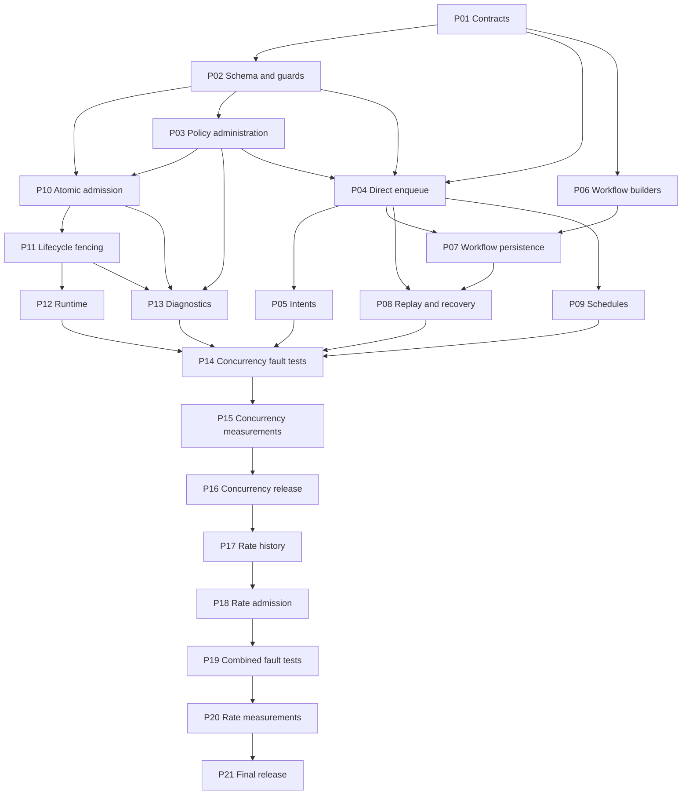

# Distributed capacity controls: implementation epic

Date: 2026-09-06.
Source baseline: `7cdb9cb`, workspace version 0.12.0.
Epic: `runledger-distributed-capacity-bp2`; 21 implementation tasks, concurrency before rates.
Status: execution plan; production implementation has not started.
Research: [reinvestigation](research/distributed-capacity-controls.md).
Protocol evidence: [executable probe](research/probes/capacity_protocol.py).
Review record: [planning reviews](research/distributed-capacity-plan-reviews.md).
The task catalog below is the implementation contract and Beads conversion source.

## 1. Outcome and delivery boundaries

Applications can attach centrally managed capacity policies to queued operations.
All participating workers sharing one PostgreSQL database observe those policies.
Local worker capacity remains independent and continues to protect each loop.
The first release provides distributed unit-count concurrency limits.
The second provides exact rolling-window admission limits, composed atomically.
Both releases cover every supported durable producer and recovery path.

An example customer policy allows 20 outstanding admitted leases.
A provider policy may additionally allow 100 admissions in a trailing 60 seconds.
A job referencing both needs room under both before it becomes leased.
One failed requirement leaves the job pending without consuming an attempt.
Capacity denial must not look like handler failure or application retry.

The contract measures leases and queue admissions.
It cannot prove that a partitioned handler stopped making external effects.
It cannot turn a multi-request handler into separately metered HTTP operations.
Applications retain authorization, provider idempotency, and downstream fencing.
No throughput, latency, or strict fairness guarantee is asserted before measurement.

The implementation epic is complete only after both release gates pass.
Closing this planning work does not close the implementation epic.
Do not activate rolling rates as part of the first concurrency rollout.
Each gate has executable acceptance work and explicit dependency edges below.

### Non-goals

- Weighted costs: each policy requirement consumes exactly one unit.
- Mandatory job-type, organization, or wildcard policy attachment.
- Automatically provisioned tenant policies or policy templates.
- Recursive hierarchies, weighted fairness, priority inheritance, and strict FIFO.
- Whole-workflow capacity held between steps.
- Provider dispatch-time rate enforcement, token buckets, and GCRA pacing.
- Changing the meaning or default of `max_global_concurrency`.
- Replacing legacy execution resources with capacity-one policies.
- A Redis dependency, a distributed lock service, or cross-database coordination.
- Broad repairs to legacy unconstrained lease-identity semantics.

## 2. Grounding and decisions from reinvestigation

The original report correctly locates coordination in PostgreSQL admission.
The source now also includes owned submissions and expanded workflow builders.
Those APIs, catalog schedules, and batched workflow writes need explicit coverage.
The checked-in probe applies every current upward migration to a fresh database.
It then adds a diagnostic protocol over actual queue and workflow relations.
It executes SQL models of claims and lifecycle transitions, not the Rust API.
Its results establish selected lock and rollback behavior, not feature readiness.

### D01: preserve an atomic claim batch

Use one explicitly READ COMMITTED transaction with per-candidate savepoints.
Expected denial or bounded lock conflict rolls back only that candidate.
Unexpected persistence errors roll back the whole outer transaction.
Return claims only after its single successful commit.
This removes the original per-candidate commit/partial-result ambiguity.
It also preserves atomic attempts, events, resource claims, and capacity state.
An ambiguous commit remains the existing recoverable prestart-lease case.
Do not return previously committed jobs hidden behind a later `Err`.

### D02: make every later candidate acquisition nonblocking

Acquire the job row, then its existing workflow step, using NOWAIT or SKIP LOCKED.
Acquire policy rows with `FOR NO KEY UPDATE NOWAIT`, sorted by immutable ID.
The step prelock is essential when earlier successful candidates retain locks.
External workflow transitions can lock steps in an order different from priority.
Rolling back a contested candidate breaks that possible wait cycle.
Claiming needs no new workflow-run or advisory lock.
Cap implicit table, foreign-key, and legacy-resource uniqueness waits separately.

### D03: preserve foreign-key compatibility

`FOR NO KEY UPDATE` serializes admissions while allowing policy FK KEY SHARE.
Policy IDs and keys are immutable; mutable limit/status/revision are not FK keys.
Policy updates must not lock jobs, workflow steps, intents, or schedules.
Archival alone uses FOR UPDATE to serialize against new attachments' KEY SHARE checks.
Normal resize/pause and admission retain the weaker NO KEY UPDATE mode.
Permit release and heartbeat must not acquire policy locks.
Counts may conservatively include concurrently released rows without overshooting.
This is simpler than maintaining a counter through every lifecycle transition.

### D04: fence constrained lifecycle updates with a generation

Prestart release can decrement an attempt and delete its attempt row.
The next claim can reuse job/run/attempt/worker values.
A fresh admission UUID therefore fences lifecycle updates as well as rate history.
Never reconstruct an admission token by reading the current UUID for a stale tuple.
Carry the UUID returned by the claim through running, progress, and completion.
An additive wrapper avoids breaking public `JobQueueRecord` and lease literals.

### D05: use conservative finite work budgets

Start with at most 24 candidate savepoints per outer transaction.
The existing intent promoter uses this bound to leave subtransaction-cache headroom.
Read at most 256 candidate ordering tuples per scan page.
Allow at most eight distinct policy requirements per job.
These are initial engineering limits, not measured optimal values or throughput claims.
The performance gate must assess subtransaction pressure and hot-policy contention.
Changing the bounds requires measurement and updates to their documented rationale.

### D06: advance beyond a blocked prefix without promising fairness

An additive stateful claim API retains an opaque ordering cursor per worker loop.
Alternate a head pass and a continuation pass on successive successful calls.
Head passes consider newly inserted higher-priority work.
Continuation passes advance after the last candidate actually examined.
Success does not reset continuation progress.
The finite stable-backlog test proves progress through more than one page.
Churning priorities, filter changes, and restarts do not carry a fairness promise.

### D07: keep durable identities and preserve absent fields

Policies have non-reusable IDs and non-reusable keys.
Archive policies rather than hard-delete them in this expansion.
Requirements reference IDs resolved from exact keys at producer persistence time.
Canonical requests carry sorted keys, without mutable numeric limits or revisions.
Legacy snapshots without capacity decode as an empty set.
Empty-capacity writers keep the old serialized shape to preserve idempotency.
Archived policy references fail closed during admission and remain auditable.

### D08: use restrictive semaphore retention and independent rate history

Concurrency permit rows reference their owning queue job with ON DELETE RESTRICT.
Queue deletion must wait for authoritative release or canceled-owner retention expiry.
This also prevents a capacity-bound canceled job's legacy resource cascade from firing early.
Rate history uses an optional audit job reference with ON DELETE SET NULL.
A queue DELETE guard also protects live constrained owners and retained legacy resources,
including rate-only jobs that have no semaphore permit to supply a restrictive FK.
Deleting jobs or attempts must never refund rate consumption.
Archived policy rows keep history and durable reference identities intact.

### D09: keep queue rates exact and explicit

Choose an exact rolling log for unit admissions in the second release.
A fixed bucket can burst across bucket boundaries and would change the promise.
Token buckets also express a different burst/refill policy.
This design pays an indexed-history cost to preserve the stated rolling contract.
If measurements make that cost unacceptable, defer release or propose another named feature.
Do not silently substitute an approximate algorithm.

### D10: require an explicit deployment cutover

Durable snapshots and token APIs require every active producer and lifecycle writer to upgrade.
Capacity migrations must participate in migration identity and compatibility validation.
Record their compatibility boundary in `runledger_migration_history`.
This can reject older binaries at startup even while all bindings are empty.
Plan a maintenance cutover; no zero-downtime old-binary restart guarantee is made.
Already running old binaries must be stopped explicitly before capacity activation.
Never treat startup validation as a mechanism that terminates running old workers.

## 3. Repository map for a fresh implementer

Read root `AGENTS.md` and the instructions under each changed crate first.
PostgreSQL 18 is the minimum and authoritative database baseline.
Use the repository test-support container defaults or a disposable `postgres:18`.
Record `SHOW server_version` for every database diagnostic and measurement.

| Responsibility | Current source |
| --- | --- |
| Shared request types | `runledger-core/src/jobs/submission.rs`, `jobs/workflow_enqueue/` |
| Public persistence types | `runledger-postgres/src/jobs/types/enqueue.rs`, `types/lifecycle.rs` |
| Direct enqueue/canonical comparison | `runledger-postgres/src/jobs/queue/enqueue.rs` |
| Intent recording/promotion/retention | `runledger-postgres/src/jobs/queue/intents.rs` |
| Batch claim and resource admission | `runledger-postgres/src/jobs/queue/claim.rs`, `claim_ids.sql` |
| Lease running/progress/heartbeat/success/failure | `runledger-postgres/src/jobs/queue/lifecycle/` |
| Prestart recovery | `runledger-postgres/src/jobs/queue/release.rs` |
| Reaper and coordination cleanup | `runledger-postgres/src/jobs/queue/reaper.rs` |
| Direct replay/retry administration | `runledger-postgres/src/jobs/replay.rs`, `jobs/admin/` |
| Workflow canonical snapshots | `runledger-postgres/src/jobs/workflows/snapshot.rs` |
| Workflow batch insertion | `runledger-postgres/src/jobs/workflows/steps/batch.rs` |
| Workflow queue creation | `runledger-postgres/src/jobs/workflows/release.rs` |
| Terminal fan-out | `runledger-postgres/src/jobs/workflows/runtime/terminal.rs` |
| Workflow recovery | `runledger-postgres/src/jobs/workflows/recovery.rs` |
| Workflow lock contracts | `runledger-postgres/src/jobs/workflows/locking.rs` |
| Schedule persistence | `runledger-postgres/src/jobs/schedules/` |
| Runtime/catalog schedule propagation | `runledger-runtime/src/scheduler.rs`, `catalog/` |
| Claim/handler/lifecycle orchestration | `runledger-runtime/src/worker.rs`, `worker/` |
| Migration compatibility | `runledger-postgres/src/migrations.rs`, `migration_identity.rs` |

No repository-owned generic queue-retention DELETE was found in this baseline.
Consumers can delete queue rows using SQL, so database retention constraints matter.
Do not claim that a nonexistent cleanup API already makes deletion safe.
Add documented cleanup behavior for coordination rows and classify deletion conflicts.

## 4. Product and public API contract

### 4.1 Policy vocabulary

Add storage-free validated types in `runledger-core::jobs`.
`CapacityPolicyKey` owns a string of 1–512 UTF-8 bytes with at least one non-whitespace character.
Use the existing execution-resource validation convention.
Keys are exact and case-sensitive; do not trim, case-fold, or Unicode-normalize them.
Canonicalization means sorting the set, not changing a key's spelling.
Use UTF-8 byte ordering in Rust and explicit COLLATE "C" in PostgreSQL key uniqueness/order.
Array validation and canonical comparison use that same ordering, independent of database locale.
The embedding application authorizes globally scoped keys.
An organization ID does not create an implicit namespace.

`JobCapacityRequirements` owns a sorted set of zero to eight keys.
Reject duplicate keys instead of silently changing a caller's request.
Expose immutable accessors and a fallible constructor.
`ConcurrencyLimit` accepts positive `i32` values.
`RollingWindowLimit` accepts positive `i32` counts and whole seconds from 1 to 86,400.
Reject zero, negative, fractional, overflowing, and longer periods explicitly.
The initial one-day bound limits supported history horizons; it is not a cost guarantee.
Kind and period become immutable when the policy is created.

### 4.2 Policy administration

`ensure_capacity_policy` creates a missing policy or verifies its complete definition.
It never resets an operator's changed limit at worker startup.
For an existing different definition, return a typed definition-conflict error.
Pause, resume, resize, and archive use an expected-revision update.
Every successful change increments revision and writes actor/reason audit atomically.
Store actor and reason as application-supplied audit metadata, not authentication proof.
Reject stale revisions and unsupported kinds; do not coerce them to unlimited.
An archived policy cannot be resumed or recreated with the same key.
No hard-delete API is included.

Paused policies accept durable references but do not admit jobs.
Archived policies reject new producer bindings.
New attachment validation takes policy KEY SHARE locks and checks state until producer commit;
archival takes FOR UPDATE without acquiring any owner locks, making their order unambiguous.
Already-bound intent promotion, schedule firing, and workflow-step materialization preserve archived references.
Those jobs become durably pending/blocked instead of aborting a prerequisite's completion.
Internal stored-reference materialization is distinct from a public new-binding request.
Matching idempotent retries can return existing archived-bound requests without reattaching them.
Existing archived references stay blocked and visible for operator resolution.
Missing policy keys reject direct enqueue, workflow enqueue/append, and schedule setup.
Intent recording also requires capacity policies to exist, although job definitions may be missing.
This intentionally narrows the original intent's definition-independent promise only for capacity provisioning.
Policy pause/archive changes are checked again under admission locks.
Numeric changes affect future admissions, without rewriting a backlog or evicting owners.
Reducing a limit below occupancy stops new admission until usage falls below that limit.

### 4.3 Enqueue options and owned submissions

Keep the fields of `JobEnqueue` and `JobSubmission` unchanged.
Add `JobEnqueueOptions` with private fields, default empty requirements, and optional resource key.
Add pool and transaction options entrypoints, including the existing outcome-returning contract.
Route old enqueue functions through empty-capacity options internally.
The existing resource-specific functions become adapters to the same internal path.
No function is needed for each possible resource/capacity combination.
`JobSubmission` remains usable via `JobEnqueue::from(&submission)` plus separate options.
An optional owned envelope must never have a conversion that silently drops its options.
The minimal release does not require an additional owned envelope.

Representative proposed call, to be compiled in P01/P04:

```rust,ignore
let requirements = JobCapacityRequirements::new([
    CapacityPolicyKey::new("customer:123:operations")?,
    CapacityPolicyKey::new("provider:abc:requests")?,
])?;
let request = JobEnqueue::from(&submission);
let options = JobEnqueueOptions::new()
    .capacity(requirements)
    .execution_resource("customer:123:exclusive-export")?;
let outcome = enqueue_job_with_options_tx(&mut tx, &request, &options).await?;
```

### 4.4 Workflow, intent, and schedule construction

Workflow job builders accept capacity requirements; external steps reject them.
Preserve the `Copy` property of `WorkflowJobStepExecution` using borrowed requirement views.
Store owned requirements at a suitable private builder/request boundary.
If borrowing cannot preserve existing signatures, use a separate accessor on `WorkflowStepEnqueue`.
Do not insert a `Vec` into a currently copyable public execution view.
Both ordinary step builders and fluent `WorkflowDagBuilder` paths need the same validation.

`JobEnqueueIntent` has private fields and can gain a capacity builder/accessor.
Recording and promoting must carry the same resolved membership and canonical keys.
Capacity is not dynamically recomputed by a promoter from payload data.
Policies may be paused while an intent waits; promotion still preserves the reference.

Schedule input and catalog spec structs have public fields.
Add options-based schedule and catalog registration/sync APIs instead of required fields.
Legacy schedule updates preserve existing capacity membership.
Schedule options explicitly distinguish Preserve (the default) from Replace(keys).
Preserve inserts empty membership for a new schedule and retains existing membership on update.
Owned catalog specs keep replacement intent and reapply it on each dynamic/exact sync.
For a locked existing schedule, only added keys are new attachments requiring archive validation.
Retaining or removing an already-bound archived key succeeds; removing and later adding it fails.
An explicit replace operation can change membership for future firings under the schedule lock.
Clearing bindings is an explicit empty replacement, never the result of omitted legacy options.
Schedule claim and firing load bindings within the existing schedule transaction.
A constrained schedule must not emit an unconstrained queue row.

### 4.5 Claim and lifecycle compatibility

Add an opaque stateful `JobClaimSession` bound to an immutable allowed-type filter.
It exposes direct and worker-prestart claim operations through a shared internal engine.
Return `JobClaimBatch` with `Vec<ClaimedJob>` and bounded diagnostic counts.
`ClaimedJob` contains a normal `JobQueueRecord` and a private `JobLeaseToken`.
The token carries the existing tuple plus the admission UUID for constrained claims.
Do not add required fields to existing public structs.
Do not expose a public constructor that fetches a current token from a stale tuple.
Normal owned cloning is allowed; token contents are fencing data, not secrets.

Provide token-based counterparts for running, ordinary progress, heartbeat, success,
failure, continuation, and prestart release; reuse one internal lifecycle implementation.
The new runtime uses these token methods for all jobs.
Unconstrained tokens may carry no admission UUID and retain existing semantics.
Legacy claim APIs exclude jobs with capacity requirements explicitly in SQL.
Apply that exclusion before resource-head selection as well as in final candidate selection.
In claim_ids.sql this covers both eligible_resource_jobs and candidates CTEs.
Legacy tuple-based lifecycle paths reject constrained rows atomically in their predicates.
Custom runtimes must adopt the new claim/token API to execute constrained jobs.
Document this capability boundary in API docs and migration examples.
Raw old SQL attempts to lease constrained rows are rejected by the database guard.

## 5. Durable schema

Use ordinary normalized PostgreSQL tables; no new external service is needed.
Give every constraint and index a stable descriptive name for diagnostics.
Use bigint for revisions and counts; prevent revision overflow explicitly.
Use UUID policy IDs and admission IDs generated once per operation.
Keys and policy IDs are immutable for the life of the database.
Requirements contain no numeric overrides.

| Relation | Required data and keys |
| --- | --- |
| `job_capacity_policies` | UUID PK, exact text key unique, kind, positive limit, period seconds, state, revision, timestamps |
| `job_capacity_policy_events` | Event ID, policy ID, old/new revision and definition, actor, reason, timestamp |
| `job_capacity_requirements` | Job ID + policy ID PK, policy FK RESTRICT, job FK CASCADE |
| `workflow_step_capacity_requirements` | Step ID + policy ID PK; step FK CASCADE; policy FK RESTRICT |
| `job_enqueue_intent_capacity_requirements` | Intent ID + policy ID PK; intent FK CASCADE; policy FK RESTRICT |
| `job_schedule_capacity_requirements` | Schedule ID + policy ID PK; schedule FK CASCADE; policy FK RESTRICT |
| `job_capacity_permits` | Policy/admission PK, job FK RESTRICT, exact tuple, deadline, release_after, policy revision |
| `job_capacity_control_state` | Singleton; concurrency_enabled and rate_enabled, initially false |
| `job_capacity_rate_admissions` | Added in rate stage: policy/admission PK, admitted_at, revision, nullable job audit FK SET NULL, immutable origin run/attempt/worker and initial deadline |

Add nullable `capacity_admission_id` to `job_queue` and `job_attempts`.
The queue value identifies the current constrained admission, not all historical admissions.
The attempt value is audit linkage and may disappear during prestart recovery.
Lease events include the admission UUID and bounded policy revision membership.
Add the rate clock floor in the rate-stage migration, not as active unused machinery.

Indexes support owner lookups and policy occupancy counts.
Permits need `(policy_id)` and `(job_id, admission_id)` access paths.
Canceled cleanup needs an ordered partial index on `(release_after, policy_id, admission_id)`.
Requirements need policy-to-owner diagnostic indexes as well as their owner-first PKs.
Rates need `(policy_id, admitted_at, admission_id)`.
Audit reads use stable ID ordering and finite limits.
Select indexes with EXPLAIN on PostgreSQL 18, including write cost in the report.

### 5.1 Lease and immutability guards

Constrained lease entry requires a non-null admission UUID and every required record.
Enumerate required policies from the authoritative immutable owner key array on both INSERT
and UPDATE; a deferred child-relation consistency check is not an immediate admission proof.
Match job ID, run, attempt, worker, admission, deadline, policy ID, and active permit state.
Reject INSERT directly into LEASED and UPDATE lease transitions without the records.
Forbid changes to constrained lease identity or admission UUID while status remains LEASED.
Heartbeat may change the deadline through its fenced lifecycle path.
Database triggers renew exact matching permits after a successful queue mutation.
An update must never bind a stale retained permit to a successor admission.
Clear queue capacity_admission_id on every lease exit; triggers release using OLD's UUID.
Rate proof at lease entry must match the immutable origin tuple and initial lease deadline.
Later heartbeat renewal does not rewrite the historical rate proof's initial deadline.
After lease entry, running/progress/heartbeat/completion validate the queue token, not rate history.
Rate cleanup may expire proof while a longer lease stays active; that does not invalidate the lease.

Bindings are immutable for an existing queue execution request.
Producer transactions insert queue rows and requirements together before visibility.
Store a sorted `capacity_policy_keys text[] NOT NULL DEFAULT '{}'` on each producer owner row.
These queue, step, intent, and schedule columns are the durable membership inputs.
An AFTER INSERT trigger resolves all keys and materializes the corresponding requirement relation.
Missing keys, duplicates, null elements, invalid keys, or more than eight keys reject insertion.
New public attachment helpers reject archived keys under KEY SHARE as specified above.
Stored-reference materialization may resolve an archived key to the same policy ID.
Queue, step, and intent membership columns cannot change after INSERT, even before first admission.
Schedule membership can change only through the explicit replacement path under its owner row lock.
An UPDATE trigger rebuilds schedule requirements atomically when that column changes.
Deferred constraint triggers verify relations exactly match the owner array and canonical snapshot.
For old unkeyed rows with NULL enqueue_request, the array supplies the immutable snapshot.
Guard direct INSERT into LEASED using the owner array, not an initially empty child relation.
Disallow direct child-relation edits that leave a mismatch at commit.
The private producer helpers pass arrays on INSERT for workflow release, replay, and direct enqueue alike.
Privileged database owners are outside the guard's trust boundary.

### 5.2 Migration identity and activation

Use new migration numbers after the latest checked-in migration at implementation time.
Do not edit historical migration bytes.
Keep the canonical and two vendored migration directories identical.
Register compatibility-relevant capacity migrations in `runledger_migration_history`.
Cover built-in migration and externally applied DDL workflows.
Schema compatibility verifies guard wiring and required schema objects.
It need not duplicate complete trigger function bodies in Rust.
Migration checksums and live catalog assertions serve their existing distinct purposes.

The database feature flags start false.
Producer APIs reject nonempty capacity options until concurrency is enabled.
Only the rate-capable release may enable rate policies.
Activation checks schema/guard compatibility; operator quiescence is an external prerequisite.
Flags are monotonic during normal operation; emergency rollback pauses producers and policies.
Down migration rejects any nonempty capacity state and is not the operational rollback route.
Never erase history to satisfy an old startup guard.

## 6. Admission protocol

All claim operations own their database transaction.
Use `begin_owned_read_committed_tx` so pool session defaults cannot weaken visibility.
There is no new caller-owned transaction claim API in this expansion.
The private admission module owns lock acquisition and rollback classification.
Do not call a public enqueue or lifecycle helper that commits internally from this path.

### 6.1 Scan state

Ordering remains priority descending, next_run_at ascending, created_at ascending, ID ascending.
The cursor stores values of that tuple, not a pointer to a row that may be deleted.
Use explicit mixed-direction predicates or overflow-safe comparisons.
Negating an i32 priority requires widening before negation.
The probe's simplified scanner is not the production cursor implementation.
Eligibility is pending, due by database time, and within allowed job types.
No capacity denial changes application `next_run_at`.

The first successful call is a head pass; the next is a continuation pass.
Head passes do not alter the stored continuation cursor.
Continuation passes resume after the last examined tuple.
Advance past denied and lock-contended candidates as well as successful candidates.
Do not advance past fetched but unexamined rows.
On EOF, reset the continuation cursor for its next pass.
The next head pass still starts at the highest-priority eligible row.
Publish cursor and alternating-pass changes only after the outer transaction commits.
On errors or dropped futures, retain the last confirmed cursor state.
Changing filters creates a new session/cursor; one session is not used concurrently.

At most 256 ordering tuples are fetched and at most 24 savepoints attempted per call.
Return at most the positive requested limit, capped by the candidate budget.
Zero/negative request limits return an empty batch with no admission work.
The runtime continues polling while its local slots remain free.
Head passes guarantee only periodic reconsideration, not immediate service.
Stable blocked-prefix tests must include more rows than both bounds.

### 6.2 One candidate

1. Create a savepoint before acquiring any candidate-specific lock.
2. Lock the selected pending/due/type-matching queue row nonblockingly and recheck it.
3. Lock its existing workflow step NOWAIT; require a valid JOB linkage/state if present.
4. Load immutable resolved requirements and verify cardinality and membership integrity.
5. Lock all policy rows in ascending UUID order with NO KEY UPDATE NOWAIT.
6. In a separate command, read their state and count all outstanding permit rows.
7. Reject missing/unsupported/paused/archived/exhausted policies without writing admissions.
8. Allocate one admission UUID; sample raw database time and derive one lease deadline.
9. Acquire the legacy resource, if any, with that deadline and a bounded conflict wait.
10. Insert every required permit and, in stage two, every rate-consumption row.
11. Lease the job, increment attempt, and set its current admission UUID.
12. Mark its workflow step running through the already-held step lock.
13. Insert the ordinary attempt and lease event with admission audit linkage.
14. Release the savepoint on success; its locks remain until outer commit.
15. On expected denial/conflict, roll back and release the savepoint completely.

Unconstrained candidates have no admission UUID requirement.
Keep the existing unconstrained/resource-only bulk SQL available to legacy claimers.
The new engine may batch a wholly unconstrained selected page only after parity proof.
It must honor the session ordering/cursor and exclude every capacity-bound row.
Do not mix two independently committed claim paths to fill one response.

### 6.3 Timeouts and error classification

Use an initial outer database transaction timeout of one second.
Cap statement_timeout by the remaining monotonic call budget before each command.
Use the smaller of existing nonzero lock_timeout, five milliseconds, and remaining budget.
Apply it to implicit locks, including resource inserts and ordinary table acquisition.
Restore capped settings on success; rollback-to-savepoint restores failed candidate settings.
The outer deadline covers commit and is also enforced by PostgreSQL transaction_timeout.
Client cancellation can make commit outcome unknown; never announce unconfirmed jobs.

Treat a policy NOWAIT miss or known resource/step lock conflict as scheduling contention.
Do not swallow arbitrary SQLSTATE 57014, constraint violations, or connection errors as denial.
Unexpected schema, guard, decoding, and audit-write failures abort the outer transaction.
Do not retry an unexpected error indefinitely while holding earlier successful locks.
A deadline may return a successfully committed smaller batch only if commit completes in budget.
If the database cancels the transaction, return an error and let prestart recovery resolve ambiguity.
Budget constants require load and slow-database testing before release.
Rate effective time is separate from raw lease time: never derive a lease/resource deadline
or heartbeat expiry from a possibly future rate clock floor.

## 7. Lease lifecycle and deletion

Every constrained mutation compares both the legacy tuple and admission UUID atomically.
Keep the queue row as the authoritative owner lock.
Use existing database-time expiry predicates after the row lock is acquired.
Runtime execution services must carry the same original token as the worker.
Administrative cancel/retry operations use their existing authority and queue locks.
They act on the selected current owner, rather than fabricating a worker token.

| Transition | Required concurrency behavior | Rate behavior in stage two |
| --- | --- | --- |
| Denied claim | No lease, permit, or attempt | No history |
| Candidate rollback | Undo that candidate completely | Undo that candidate completely |
| Outer rollback | Undo every successful candidate | Undo all uncommitted history |
| Running/progress | Check current token; preserve permit | No refund |
| Heartbeat | Renew matching permit deadline with queue deadline | No change |
| Success/terminal failure | Delete exact owner's permits in queue transition | Retain history |
| Retry/continuation | Release old owner; preserve requirements | Next claim consumes again |
| Prestart release | Release exact admission despite attempt decrement | Retain committed history |
| Live cancellation | Set release_after to the former live lease deadline | Retain history |
| Expired queue owner | Reaper transitions owner before releasing permits | Retain history |
| Stale token | No queue, permit, attempt, or event mutation | No deletion |
| Replay/recovery | New owner/admission with the same membership | New consumption |
| Queue deletion | RESTRICT while any semaphore permit remains | Nullable audit link only |

Cancellation permits remain counted even if the job is already terminal.
Do not release them just because a caller asks to retain fewer historical jobs.
Completion after cancellation cannot free retained permits using the old worker token.
Cleanup deletes retained rows only after release_after is reached by database time.
It uses bounded batches and does not lock policy rows.
An expired ordinary permit is not eligible while its exact queue owner is still leased.
Do not cascade permit deletion from attempt retention.
The queue DELETE guard rejects every still-LEASED constrained owner, even if its deadline passed.
For terminal constrained jobs it also rejects deletion while a matching legacy resource has
release_after in the future or remains unreleased without a retained deadline.
Identify constrained rows by the immutable nonempty key array after cancellation.
Find retained legacy claims by job_id; cleared current UUID/worker fields cannot identify them.
This rule applies to rate-only bindings as well as semaphore-bound jobs.
At a canceled resource's passed retention deadline, deletion may cascade that quiesced resource.

Reaping and cleanup are separate bounded operations as in the existing reaper.
Failure of cleanup is observable and conservatively reduces available capacity.
A later cleanup pass must recover without corrupting owner state.
Heartbeat and reaper races must be tested in both orderings using lock barriers.
Stale updates after replay, continuation, and reused prestart attempts must be inert.

## 8. Canonical snapshots and producer propagation

The proposed wire field is `capacity_policy_keys` containing sorted exact strings.
Omit it when empty; decode an absent field as empty.
Reject duplicates, unknown fields where recovery is strict, and unsupported versions.
An explicit empty field is normalized to absent during typed comparison.
Do not compare legacy JSON with a new defaulted field using raw equality alone.
Keep direct empty-capacity canonical v1 bytes/shapes unchanged.
Constrained enqueue intents emit request version 2; promotion supports versions 1 and 2.
Update both promotion candidate filtering and stored-request validation.
Workflow enqueue/append compare normalized typed capacity membership.
Strict recovery learns the field before constrained snapshots are emitted.

Store stable policy identities relationally and immutable keys canonically.
Changing numeric limits must not conflict with an identical enqueue retry.
Changing membership must conflict even when payload and idempotency key are identical.
Policy key non-reuse makes canonical membership stable across archival.
Recovery checks relational membership against canonical membership and rejects drift.
Never recover a constrained source into unconstrained work because an optional field was missed.

| Producer or transition | Binding source | Persistence/validation obligation |
| --- | --- | --- |
| Direct unkeyed enqueue | Options | Internal membership snapshot + queue relation |
| Direct keyed enqueue/outcome | Options + canonical request | Strict normalized idempotency |
| Owned submission adapter | Separate options | Compile and behavior parity |
| Intent recording | Intent builder | Version 2 snapshot + intent relation |
| Intent promotion | Stored intent | Preserve membership and support old backlog |
| Workflow enqueue | Job step builder | Canonical run snapshot + step relation |
| Workflow append | Appended job step | Append snapshot + batched step relation |
| Dependency release | Stored step relation | Queue relation in release transaction |
| Terminal fan-out | Reloaded release candidate | Preserve requirements on direct queue INSERT |
| Handler continuation | Existing queue request | Preserve membership through slice change |
| Direct retry/replay | Source membership | Retain/recreate immutable requirements |
| Workflow full recovery | Canonical + relational verification | Preserve recovered step membership |
| Schedule setup and catalog sync | Explicit options | Store schedule relation atomically |
| Schedule firing | Locked schedule | Copy requirements with fired queue row |

Golden examples are in [capacity contract fixtures](research/capacity-contract-fixtures.json).
They are proposed wire fixtures, not evidence that current decoders already accept capacity.
P01/P04/P06 must turn them into executable compatibility tests.
Maintain legacy fixture tests unchanged wherever the empty-capacity contract is unchanged.

## 9. Rolling admission rates

Begin rate implementation only after the concurrency release gate is closed.
Reuse the same policy lock and all-or-none candidate savepoint.
Do not add a rate semaphore or refund path.
Each distinct policy on each committed admission gets one rate row.
Use the same admission UUID across concurrency and rate requirements for one job.
Use a new UUID for every retry, continuation slice, and prestart reacquisition.

### 9.1 Time and window evaluation

After locking all policies, sample clock_timestamp exactly once.
Use a nondecreasing database time floor to handle backward clock movement conservatively.
Define one candidate effective time as the maximum of that sample and all involved rate floors.
Count all history with admitted_at greater than effective_time minus period.
Do not exclude future timestamps from the count after backward clock movement.
Admit only when every referenced rate usage is below its current limit.
Update involved rate floors and insert history atomically with the lease.
Kind and window duration remain immutable; count limits may change by revision.

The admission timestamp is a decision-time value, not commit or dispatch time.
Document logical database time when the clock floor is active.
Forward clock jumps and failover clock skew cannot prove physical elapsed time.
Provide deterministic injected-time tests in a private evaluator, never a public client-time API.
Test the exact open-left boundary: a row at t-period no longer counts at t.
Large effective-time discontinuities require operator visibility, not silent physical-rate claims.

### 9.2 Cleanup and archived policies

Rate history cleanup must serialize with its policy's time-floor advancement.
Use policy NO KEY UPDATE NOWAIT before computing a safe cutoff.
Advance the floor to at least the cleanup time and delete only rows outside its fixed window.
This prevents cleanup followed by backward time from forgetting still-relevant history.
Do not acquire job locks under the cleanup policy lock.
Delete a bounded ordered batch through `(policy_id, admitted_at, admission_id)`.
Skip contended policies and return bounded diagnostics for later passes.
An archived policy still receives safe history cleanup under the same rules.
Policy events are retained independently of hot rate history.
Expose a pool-owned cleanup API and call it automatically from the runtime reaper.
Each invocation visits at most 16 policies and deletes at most 1,000 total rows.
Use a value-based policy-ID continuation cursor, advancing over contended policies and resetting at EOF.
Return bounded progress/error diagnostics; the reaper retains the cursor after confirmed commits.
If a commit outcome is uncertain, stop the invocation and retain the last confirmed cursor;
retry on the next reaper tick instead of risking an untracked second deletion budget.
Use one bounded transaction per visited policy and never acquire queue-owner locks.
Include active, paused, and archived policies; rate-disabled empty deployments have no work.
P17 supplies the shared internal floor/window evaluator and a SQL protocol race harness;
P18 connects it to production admission, so P17 tests do not imply premature rate activation.

## 10. Diagnostics and operating behavior

Add paginated policy, occupancy, retained-owner, rate-usage, and blocked-sample reads.
Expose kind, state, current revision/limit, and explicitly sampled database time.
Policy-specific reads require application authorization; the library does not infer it.
A diagnostic occupancy snapshot is observational, never an admission authorization token.
Separate exhausted, paused, archived, missing/unsupported, lock-contention, and internal-error reasons.
Internal errors must be actionable failures rather than normal blocked-job samples.
Do not write a durable job event for every denied poll.

Aggregate metrics by bounded reason and policy kind.
Never label metrics with arbitrary customer keys, job IDs, or worker IDs.
Structured diagnostic reads/logs may include requested policy keys and admission IDs.
Track scans per success, claim latency, transaction aborts, cleanup backlog, and heartbeat latency.
Retain ordinary lifecycle audit events and link successful admissions to them.
Document that `JOBS_MAX_GLOBAL_CONCURRENCY` remains per worker loop with default 32.
No environment alias or rename is necessary for this epic.

## 11. Release, rollback, and verification

### Concurrency cutover

1. Finish P01–P15 with all capacity flags false in staging.
2. Inventory all direct claimers, workers, schedulers, promoters, reapers, and recovery tools.
3. Pause producers that will attach capacity; stop/drain old worker and lifecycle binaries.
4. Apply the new migration bundle during the planned maintenance cutover.
5. Verify PostgreSQL 18 version, migration identities, and capacity guard wiring.
6. Deploy compatible binaries and validate empty-capacity regression behavior.
7. Enable concurrency and provision explicit policies; roll out a small binding set.
8. Verify bounded occupancy, healthy heartbeats, and backlog progress before broadening.
9. Close P16 only after the runbook rehearsal and concurrency release evidence exist.

An old binary that has already started is not made safe by a migration-history row.
The lease guard prevents unconstrained execution of bound work, but repeated old batches can fail.
Stop those binaries rather than relying on their failures as steady-state operation.
An old schedule writer must not erase a stored binding; legacy updates preserve membership.
Operators must not use an old scheduler to fire constrained schedules during the cutover.

### Operational rollback

Pause constrained producers and schedules; keep compatible reapers/cleanup running.
Pause policies if no new constrained admissions should occur.
Drain active leases and wait for retained cancellation deadlines.
Keep pending constrained jobs, intents, steps, and rate history intact.
Roll back application behavior while retaining a compatible coordination binary/schema.
Returning to a pre-capacity binary requires a separately rehearsed offline export/reconciliation.
Never strip bindings or remove compatibility-history rows as an operational shortcut.
Schema down migrations are only for an empty disposable validation database.

### Required validation commands

Run targeted crate tests for each task, then the complete relevant suites at release gates.
Use `cargo test -p runledger-core` for shared contract changes.
Use `cargo test -p runledger-postgres` for persistence and database lifecycle changes.
Use `cargo test -p runledger-runtime` for worker/scheduler/reaper integration.
Use `bash scripts/lint.sh` and `bash scripts/run-external-consumer-smoke.sh` at gates.
Before SQLx refresh, apply current migrations to PostgreSQL 18 and record server_version.
Use `bash scripts/refresh-sqlx-cache.sh` and check all three metadata directories match.
Check package migration copies and migration bundle/pipeline identity fixtures.
Do not run an unrelated production database diagnostic as a substitute for these tests.

### Evidence acceptance

Concurrency fixtures require independent pools and at least one multi-process claimant test.
Use barriers and observed lock states instead of sleeps to establish race orderings.
Test admission rollback before lease, after permits, during attempt/event writes, and at commit loss.
Test every row of the producer and lifecycle matrices.
Test empty-capacity parity, raw old-writer guard failure, and public literal compilation.
Measure unconstrained, dispersed-policy, and one-hot-policy distributions separately.
Record p50/p95/p99 latency, throughput, scanned candidates, buffers, writes, and cleanup work.
Compare custom and generic query plans where the current claim parity suite does.
Investigate material regressions before release; do not invent a passing numeric SLO afterward.

## 12. Task catalog and dependency contract

Every task below is an implementation task, not another request to decide product behavior.
Each task identifies prerequisites, concrete source boundaries, outputs, tests, and consumers.
P16 is the concurrency release gate; P21 is the complete expansion release gate.
Parent-child epic membership is separate from blocking dependencies.
After conversion, use `br show <id> --json` and `br ready --json` for live status.
Do not close an implementation task because its specification was written.

### Primary PostgreSQL sources checked during planning

- [READ COMMITTED visibility](https://www.postgresql.org/docs/18/transaction-iso.html): separate commands see newly committed state.
- [Row-lock modes](https://www.postgresql.org/docs/18/explicit-locking.html): policy lock compatibility and savepoint lock release.
- [SELECT locking](https://www.postgresql.org/docs/18/sql-select.html): NOWAIT/SKIP LOCKED do not bound all table locks.
- [Time functions](https://www.postgresql.org/docs/18/functions-datetime.html): transaction time differs from clock_timestamp.
- [Client timeouts](https://www.postgresql.org/docs/18/runtime-config-client.html): database statement, lock, and transaction budgets.
- [Function volatility](https://www.postgresql.org/docs/18/xfunc-volatility.html): the SQL probe uses separate VOLATILE commands.
- [Subtransactions](https://www.postgresql.org/docs/18/subxacts.html): motivation for measuring bounded savepoint batches.
- [Collation](https://www.postgresql.org/docs/18/collation.html): explicit bytewise key ordering independent of database locale.

Architectural consequences above are design inferences from these documented primitives.
The lock/rollback probe is additional evidence; it does not replace production integration tests.

<!-- TASK_CATALOG -->

### P01 — Add validated capacity requirements, options, and claim-token contracts

Stage: distributed concurrency.
Blocked by: none (implementation entry task).
Unblocks: P02, P04, P06.
Source boundaries: runledger-core/src/jobs/{identifiers,submission}.rs; runledger-core/src/jobs.rs; runledger-postgres/src/jobs/types/{enqueue,lifecycle}.rs; smoke/external-consumer.

Context for standalone execution:

Implement this task in the Runledger Rust workspace at the current baseline derived from 7cdb9cb.
Read root and crate AGENTS.md instructions; PostgreSQL 18 is authoritative for every database test.
The feature uses explicit globally scoped policy keys, unit costs, and all-required admission.
Concurrency is lease-scoped; rate consumption belongs to committed queue admission and is never refunded.
Policy identity/key/kind/window are immutable; current limits and pause state apply at admission.
Existing public request/record/lease/schedule struct literals must continue compiling.
Carry the original admission UUID through constrained lifecycle writes; never look up a successor token.
Preserve queue/workflow audit events, idempotency, legacy resources, and application scheduling semantics.
Requirements contain zero to eight distinct exact keys, each nonblank and at most 512 UTF-8 bytes.
Counts are positive i32 values; immutable rate windows contain 1–86,400 whole seconds.
Lease deadlines use raw database time; rate effective-time floors never determine lease expiry.

Rationale:

Immutable validated types give every producer one definition of membership while additive wrappers preserve downstream public struct literals.

Required changes:

- Add exact case-sensitive CapacityPolicyKey validation: nonblank, at most 512 UTF-8 bytes, with no trimming or normalization.
- Add sorted JobCapacityRequirements with zero to eight distinct keys; reject duplicates and expose immutable accessors.
- Add positive i32 concurrency counts and whole-second rolling periods of 1–86,400 seconds; keep rate activation unavailable until P18.
- Introduce private-field JobEnqueueOptions composing capacity and a legacy execution resource; retain existing JobSubmission and JobEnqueue field sets.
- Introduce private-field JobLeaseToken and ClaimedJob/JobClaimBatch wrapper contracts; only claim internals construct a token carrying its admission UUID.
- Specify JobClaimSession's immutable filter, head/continuation cursor state, and non-concurrent use; no mutable global process cursor.
- Inventory token lifecycle method signatures for running, progress, heartbeat, success, failure, continuation, and prestart release before P11.
- Use UTF-8 byte ordering and PostgreSQL COLLATE "C" consistently for key canonicalization, uniqueness, and array checks.

Verification:

- Boundary tests cover whitespace-only, multibyte key size, eight/nine requirements, duplicates, exact spelling, and numeric/period overflow.
- Compile old JobSubmission, JobEnqueue, JobQueueRecord, JobLeaseIdentity, schedule, and catalog spec literals in the external-consumer smoke fixture.
- Proposed call examples compile once storage entrypoints land; no From conversion may discard options.
- Run cargo test -p runledger-core and targeted public API compile checks; this task requires no database benchmark.

Acceptance:

New contracts compile, preserve old literals, and cannot manufacture a successor token by a stale-tuple lookup. All invalid inputs have typed errors.

Completion evidence:

- Record changed interfaces, migrations, and observable behavior in the task.
- Record checks actually run; database results include exact server_version.
- Update dependent tasks if implementation evidence changes this contract.
- Keep production activation behind P16; this task grants no separate deployment action.

### P02 — Add concurrency schema, immutable bindings, and database lease guards

Stage: distributed concurrency.
Blocked by: P01.
Unblocks: P03, P04, P10.
Source boundaries: migrations/; runledger-postgres/migrations/; runledger-test-support/migrations/; runledger-postgres/src/{migrations,migration_identity}.rs.

Context for standalone execution:

Implement this task in the Runledger Rust workspace at the current baseline derived from 7cdb9cb.
Read root and crate AGENTS.md instructions; PostgreSQL 18 is authoritative for every database test.
The feature uses explicit globally scoped policy keys, unit costs, and all-required admission.
Concurrency is lease-scoped; rate consumption belongs to committed queue admission and is never refunded.
Policy identity/key/kind/window are immutable; current limits and pause state apply at admission.
Existing public request/record/lease/schedule struct literals must continue compiling.
Carry the original admission UUID through constrained lifecycle writes; never look up a successor token.
Preserve queue/workflow audit events, idempotency, legacy resources, and application scheduling semantics.
Requirements contain zero to eight distinct exact keys, each nonblank and at most 512 UTF-8 bytes.
Counts are positive i32 values; immutable rate windows contain 1–86,400 whole seconds.
Lease deadlines use raw database time; rate effective-time floors never determine lease expiry.

Rationale:

Database guards cover custom claimers and direct deletion paths that runtime-only admission cannot protect.

Required changes:

- Add policy, policy-event, owner-requirement, semaphore-permit, and disabled-by-default control-state tables; add nullable admission UUID to queue and attempts.
- Add sorted immutable capacity_policy_keys owner arrays for queue, workflow steps, and intents; schedule arrays are explicitly replaceable under the schedule lock.
- Materialize requirement rows from owner arrays on INSERT using all-or-error policy resolution; rebuild schedule membership only on explicit array replacement.
- Add deferred array/relation/canonical consistency checks, including unkeyed jobs, external-step prohibition, duplicate/null elements, and maximum cardinality.
- Guard direct LEASED INSERT, lease entry, and in-lease identity changes against missing or mismatched admissions; permit valid fenced heartbeat deadline renewal.
- Make permit job FKs RESTRICT and policy identities immutable/non-reusable; do not cascade semaphore ownership from attempts or queue retention.
- Register the migration compatibility boundary, validate live guard wiring, and provide down migrations that reject nonempty coordination state.
- Synchronize the three migration bundles and refresh SQLx caches only on PostgreSQL 18 with current migrations.
- Permit stored-reference materialization of archived policies; public attachment validation rejects new archived bindings. Clear current UUID on lease exit, forbid in-lease identity changes, and guard deletion of live/retained constrained legacy resources independently of semaphore rows.
- Use the authoritative immutable owner array to enumerate required policies at both lease INSERT and UPDATE; do not rely solely on deferred child consistency.

Verification:

- PostgreSQL 18 migration tests cover fresh install, upgrade from 7cdb9cb, external DDL compatibility, and empty-only down/up.
- Raw SQL attempts to lease without all permits or mutate binding membership fail; valid empty-capacity legacy rows remain usable.
- Deletion of a canceled queue owner with retained permits is rejected and does not cascade its legacy resource away.
- Record exact server_version and verify migration copies, bundle/pipeline identities, and the three SQLx cache sets.

Acceptance:

The database cannot silently lease or delete capacity-bound ownership through supported old SQL shapes; durable arrays and requirement relations remain consistent.

Completion evidence:

- Record changed interfaces, migrations, and observable behavior in the task.
- Record checks actually run; database results include exact server_version.
- Update dependent tasks if implementation evidence changes this contract.
- Keep production activation behind P16; this task grants no separate deployment action.

### P03 — Implement revisioned capacity policy administration and activation

Stage: distributed concurrency.
Blocked by: P02.
Unblocks: P04, P10, P13.
Source boundaries: runledger-postgres/src/jobs/capacity/{policies,types,errors}.rs (new); runledger-postgres/src/jobs.rs; error classification.

Context for standalone execution:

Implement this task in the Runledger Rust workspace at the current baseline derived from 7cdb9cb.
Read root and crate AGENTS.md instructions; PostgreSQL 18 is authoritative for every database test.
The feature uses explicit globally scoped policy keys, unit costs, and all-required admission.
Concurrency is lease-scoped; rate consumption belongs to committed queue admission and is never refunded.
Policy identity/key/kind/window are immutable; current limits and pause state apply at admission.
Existing public request/record/lease/schedule struct literals must continue compiling.
Carry the original admission UUID through constrained lifecycle writes; never look up a successor token.
Preserve queue/workflow audit events, idempotency, legacy resources, and application scheduling semantics.
Requirements contain zero to eight distinct exact keys, each nonblank and at most 512 UTF-8 bytes.
Counts are positive i32 values; immutable rate windows contain 1–86,400 whole seconds.
Lease deadlines use raw database time; rate effective-time floors never determine lease expiry.

Rationale:

Central definitions prevent workers from enforcing different limits and keep startup ensure operations from overwriting operator decisions.

Required changes:

- Add ensure/create/read APIs for globally scoped exact keys; existing different definitions return a conflict without mutation.
- Implement expected-revision resize, pause, resume, and archive with actor/reason audit in the same transaction.
- Keep ID, key, kind, and rolling period immutable; do not add policy deletion or key reuse.
- Use policy NO KEY UPDATE locks; never acquire queue, step, intent, or schedule row locks while holding a policy administration lock.
- Archived policies reject new bindings and stay visible to existing references; paused policies accept bindings but deny admission.
- Implement explicit schema-checked concurrency activation; keep rate activation inaccessible until the rate release capability exists.
- Add typed missing, archived, unsupported, stale-revision, definition-conflict, and disabled-feature errors without generic unlimited fallbacks.
- Serialize new attachment validation with policy KEY SHARE against archival FOR UPDATE; ordinary resize/pause use NO KEY UPDATE. Archival never locks owners.

Verification:

- Race two expected-revision updates: exactly one succeeds and its audit row matches the resulting policy.
- Ensure after an operator resize returns conflict and preserves the operator's state.
- Verify raising/lowering limits and pause/archive do not mutate existing jobs or permits.
- Verify FK writers can attach existing policy IDs while an admission-compatible policy lock is held.

Acceptance:

Administration is revision-safe and auditable; identity is stable, flags default off, and no operation takes policy-to-owner locks.

Completion evidence:

- Record changed interfaces, migrations, and observable behavior in the task.
- Record checks actually run; database results include exact server_version.
- Update dependent tasks if implementation evidence changes this contract.
- Keep production activation behind P16; this task grants no separate deployment action.

### P04 — Propagate capacity through direct enqueue and canonical idempotency

Stage: distributed concurrency.
Blocked by: P01, P02, P03.
Unblocks: P05, P07, P08, P09.
Source boundaries: runledger-postgres/src/jobs/queue/enqueue.rs; jobs/types/enqueue.rs; jobs/errors.rs; tests/enqueue_outcome.rs.

Context for standalone execution:

Implement this task in the Runledger Rust workspace at the current baseline derived from 7cdb9cb.
Read root and crate AGENTS.md instructions; PostgreSQL 18 is authoritative for every database test.
The feature uses explicit globally scoped policy keys, unit costs, and all-required admission.
Concurrency is lease-scoped; rate consumption belongs to committed queue admission and is never refunded.
Policy identity/key/kind/window are immutable; current limits and pause state apply at admission.
Existing public request/record/lease/schedule struct literals must continue compiling.
Carry the original admission UUID through constrained lifecycle writes; never look up a successor token.
Preserve queue/workflow audit events, idempotency, legacy resources, and application scheduling semantics.
Requirements contain zero to eight distinct exact keys, each nonblank and at most 512 UTF-8 bytes.
Counts are positive i32 values; immutable rate windows contain 1–86,400 whole seconds.
Lease deadlines use raw database time; rate effective-time floors never determine lease expiry.

Rationale:

The producer boundary must freeze membership without freezing mutable limits, including for unkeyed jobs and owned submissions.

Required changes:

- Add pool and transaction options enqueue APIs with the existing outcome semantics; retain resource-only and plain functions as adapters.
- Pass immutable key arrays into the queue INSERT so triggers create requirements atomically before commit.
- Preserve existing v1 canonical shape for empty capacity; encode sorted capacity_policy_keys only when nonempty.
- Use typed normalization so omitted and explicitly empty capacity compare equal, while changed membership conflicts.
- Preserve mutation-ready locks for existing outcome rows and the existing READ COMMITTED transaction contract.
- Resolve missing/archived policies as producer errors and feature-disabled nonempty requests as explicit errors; allow paused policy references.
- Keep payload, scheduling overrides, resource key, and capacity membership together through JobSubmission borrowing.
- Validate new attachments under policy KEY SHARE; matching idempotent retries return existing archived-bound requests without creating new attachments.

Verification:

- Use the checked-in proposed legacy/constrained canonical fixtures as golden compatibility cases.
- Identical requests with reversed input-key order deduplicate; changed membership conflicts; a policy resize does not conflict.
- Unkeyed enqueue persists capacity membership and rolls back all rows on any requirement failure.
- Existing resource plus multiple capacity policies survives enqueue/outcome lookup without changing original literal callers.

Acceptance:

Every direct enqueue mode persists exactly one immutable normalized membership, and old empty-capacity idempotent retries remain compatible.

Completion evidence:

- Record changed interfaces, migrations, and observable behavior in the task.
- Record checks actually run; database results include exact server_version.
- Update dependent tasks if implementation evidence changes this contract.
- Keep production activation behind P16; this task grants no separate deployment action.

### P05 — Carry capacity through intent recording, promotion, and retention

Stage: distributed concurrency.
Blocked by: P04.
Unblocks: P14.
Source boundaries: runledger-postgres/src/jobs/queue/intents.rs; jobs/types/enqueue.rs; runledger-runtime/src/intent_promoter.rs; tests/job_enqueue_intents.rs.

Context for standalone execution:

Implement this task in the Runledger Rust workspace at the current baseline derived from 7cdb9cb.
Read root and crate AGENTS.md instructions; PostgreSQL 18 is authoritative for every database test.
The feature uses explicit globally scoped policy keys, unit costs, and all-required admission.
Concurrency is lease-scoped; rate consumption belongs to committed queue admission and is never refunded.
Policy identity/key/kind/window are immutable; current limits and pause state apply at admission.
Existing public request/record/lease/schedule struct literals must continue compiling.
Carry the original admission UUID through constrained lifecycle writes; never look up a successor token.
Preserve queue/workflow audit events, idempotency, legacy resources, and application scheduling semantics.
Requirements contain zero to eight distinct exact keys, each nonblank and at most 512 UTF-8 bytes.
Counts are positive i32 values; immutable rate windows contain 1–86,400 whole seconds.
Lease deadlines use raw database time; rate effective-time floors never determine lease expiry.

Rationale:

Intents outlive deployments and definitions; promotion must not discard constraints or strand old request versions.

Required changes:

- Add a capacity builder to private-field JobEnqueueIntent and persist immutable arrays plus version 2 canonical requests for constrained intents.
- Keep recording independent of job definitions, while requiring all referenced capacity policies to be provisioned.
- Accept and promote both request versions 1 and 2; update version filtering, stored reconstruction, and malformed-request classification.
- Promote through the options enqueue helper with the same membership; a paused policy does not strip requirements or prevent durable queue creation.
- Preserve strict idempotency and conflicts across direct enqueue versus intent promotion for the same request.
- Retain the existing 24-row promoter savepoint bound and transaction/retention fencing; do not nest new candidate savepoints blindly.
- Ensure intent retention only deletes the intent's references; it cannot remove queue permits or unexpired rate consumption.
- Promotion materializes an already-bound request even after its policy is archived; preserve the reference and let admission block the new queue row.

Verification:

- Promote a mixed v1/v2 backlog, including missing job definitions, paused policies, and duplicate direct enqueues.
- Malformed or drifted canonical capacity conflicts visibly and does not create an unconstrained job.
- Rollback and retry promotion prove one queue membership and no duplicate effects.
- Run targeted intent and promoter tests on PostgreSQL 18 and record its version.

Acceptance:

Old intents continue to promote and constrained intents preserve membership through every promotion or conflict path.

Completion evidence:

- Record changed interfaces, migrations, and observable behavior in the task.
- Record checks actually run; database results include exact server_version.
- Update dependent tasks if implementation evidence changes this contract.
- Keep production activation behind P16; this task grants no separate deployment action.

### P06 — Extend workflow builders and canonical snapshots compatibly

Stage: distributed concurrency.
Blocked by: P01.
Unblocks: P07.
Source boundaries: runledger-core/src/jobs/workflow_enqueue/; runledger-postgres/src/jobs/workflows/snapshot.rs; core builder and snapshot tests.

Context for standalone execution:

Implement this task in the Runledger Rust workspace at the current baseline derived from 7cdb9cb.
Read root and crate AGENTS.md instructions; PostgreSQL 18 is authoritative for every database test.
The feature uses explicit globally scoped policy keys, unit costs, and all-required admission.
Concurrency is lease-scoped; rate consumption belongs to committed queue admission and is never refunded.
Policy identity/key/kind/window are immutable; current limits and pause state apply at admission.
Existing public request/record/lease/schedule struct literals must continue compiling.
Carry the original admission UUID through constrained lifecycle writes; never look up a successor token.
Preserve queue/workflow audit events, idempotency, legacy resources, and application scheduling semantics.
Requirements contain zero to eight distinct exact keys, each nonblank and at most 512 UTF-8 bytes.
Counts are positive i32 values; immutable rate windows contain 1–86,400 whole seconds.
Lease deadlines use raw database time; rate effective-time floors never determine lease expiry.

Rationale:

Workflow snapshots are durable requests and strict recovery must learn new fields before producers emit them.

Required changes:

- Add capacity to ordinary job-step builders and WorkflowDagBuilder configuration with the same validated requirement set.
- Reject capacity for EXTERNAL steps before persistence and preserve existing execution-view Copy/source contracts.
- Use a separate private stored requirement field/accessor if needed instead of changing a copyable execution view into an owned Vec.
- Add sorted optional capacity_policy_keys to canonical workflow steps and normalized append comparison.
- Update strict recovery schemas explicitly, default absent capacity to empty, and keep unrelated unknown-field rejection.
- Keep empty-capacity JSON serialization shape stable for old run and append snapshots.
- Turn the proposed workflow/append legacy and constrained fixtures into real decoder and canonical-comparison tests.

Verification:

- Exercise both builder families with resources, continuations, dependencies, and capacity together.
- Verify EXTERNAL steps reject capacity, duplicated keys fail, and empty legacy workflows stay unchanged.
- Decode historical fixtures and round-trip constrained snapshots through strict recovery types.
- Run core and targeted PostgreSQL snapshot tests without claiming full workflow persistence integration.

Acceptance:

All workflow construction paths share validation and every durable snapshot reader has an explicit old/new capacity contract.

Completion evidence:

- Record changed interfaces, migrations, and observable behavior in the task.
- Record checks actually run; database results include exact server_version.
- Update dependent tasks if implementation evidence changes this contract.
- Keep production activation behind P16; this task grants no separate deployment action.

### P07 — Persist workflow capacity through batching, append, release, and fan-out

Stage: distributed concurrency.
Blocked by: P04, P06.
Unblocks: P08.
Source boundaries: runledger-postgres/src/jobs/workflows/{enqueue,release}.rs; workflows/mutate/append.rs; workflows/steps/batch.rs; workflows/runtime/terminal.rs.

Context for standalone execution:

Implement this task in the Runledger Rust workspace at the current baseline derived from 7cdb9cb.
Read root and crate AGENTS.md instructions; PostgreSQL 18 is authoritative for every database test.
The feature uses explicit globally scoped policy keys, unit costs, and all-required admission.
Concurrency is lease-scoped; rate consumption belongs to committed queue admission and is never refunded.
Policy identity/key/kind/window are immutable; current limits and pause state apply at admission.
Existing public request/record/lease/schedule struct literals must continue compiling.
Carry the original admission UUID through constrained lifecycle writes; never look up a successor token.
Preserve queue/workflow audit events, idempotency, legacy resources, and application scheduling semantics.
Requirements contain zero to eight distinct exact keys, each nonblank and at most 512 UTF-8 bytes.
Counts are positive i32 values; immutable rate windows contain 1–86,400 whole seconds.
Lease deadlines use raw database time; rate effective-time floors never determine lease expiry.

Rationale:

Workflow release and terminal fan-out insert queue rows directly, so enqueue-only changes would silently drop bindings.

Required changes:

- Pass capacity arrays through batched workflow step insertion and immutable step requirement creation.
- Persist append membership in the same mutation transaction and preserve append idempotency locks and snapshots.
- Extend release candidate loading to carry the stored step's complete membership.
- Copy membership into every queue INSERT in release and terminal fan-out, including previously blocked dependent steps.
- Preserve the repository job-before-step/advisory cancellation order; requirement FK access must not upgrade policy locks.
- Keep per-operation permits scoped to admitted queue leases rather than holding them for an entire workflow.
- Validate relational membership against immutable source step arrays; fail closed on malformed or unsupported state.
- Materialize already-bound archived references without aborting the prerequisite terminal transition; resulting jobs remain blocked at admission.

Verification:

- Enqueue and append DAGs with constrained roots and delayed children; every released queue row has the expected policies.
- Exercise external-step completion, terminal dependency fan-out, batched inserts, and cancellation interleavings.
- Verify capacity-one legacy resource composition and handler continuation opt-in survive the new persistence path.
- Run workflow batch, dependency persistence, ordering, and resource tests on PostgreSQL 18.

Acceptance:

Every workflow-created job inherits exactly its job step's requirements, including deferred release and terminal fan-out.

Completion evidence:

- Record changed interfaces, migrations, and observable behavior in the task.
- Record checks actually run; database results include exact server_version.
- Update dependent tasks if implementation evidence changes this contract.
- Keep production activation behind P16; this task grants no separate deployment action.

### P08 — Preserve capacity in replay, retry administration, and workflow recovery

Stage: distributed concurrency.
Blocked by: P04, P07.
Unblocks: P14.
Source boundaries: runledger-postgres/src/jobs/replay.rs; jobs/admin/recovery.rs and related admin modules; jobs/workflows/recovery.rs.

Context for standalone execution:

Implement this task in the Runledger Rust workspace at the current baseline derived from 7cdb9cb.
Read root and crate AGENTS.md instructions; PostgreSQL 18 is authoritative for every database test.
The feature uses explicit globally scoped policy keys, unit costs, and all-required admission.
Concurrency is lease-scoped; rate consumption belongs to committed queue admission and is never refunded.
Policy identity/key/kind/window are immutable; current limits and pause state apply at admission.
Existing public request/record/lease/schedule struct literals must continue compiling.
Carry the original admission UUID through constrained lifecycle writes; never look up a successor token.
Preserve queue/workflow audit events, idempotency, legacy resources, and application scheduling semantics.
Requirements contain zero to eight distinct exact keys, each nonblank and at most 512 UTF-8 bytes.
Counts are positive i32 values; immutable rate windows contain 1–86,400 whole seconds.
Lease deadlines use raw database time; rate effective-time floors never determine lease expiry.

Rationale:

Recovery must create new admissions under current limits while retaining the original immutable membership and lineage.

Required changes:

- Inventory direct retry/replay administrative paths and copy or preserve source capacity arrays in each.
- Keep direct replay lineage, request-key idempotency, immutable payload snapshots, and existing scope authorization hooks.
- Reconstruct workflow recovery from canonical snapshots and verify membership against source arrays/relations before creating new steps.
- Reject missing, malformed, unknown, or drifted capacity fields rather than recovering unconstrained work.
- Preserve references to paused policies; archived policies cannot create fresh recovered bindings and must return an explicit error.
- Do not copy admission UUIDs, permit rows, or mutable limit values into a replayed execution.
- Keep old recovery snapshots with absent capacity readable and unchanged in behavior.

Verification:

- Replay successful, failed, and administratively retried constrained direct jobs with updated policy limits.
- Recover workflows containing appended steps, resources, and continuation-enabled jobs; verify all new memberships.
- Inject canonical/relational drift and archived policies and assert atomic failure with no partially recovered jobs.
- Run succeeded-job replay and workflow recovery suites on PostgreSQL 18.

Acceptance:

Recovery preserves membership and lineage, creates fresh execution identity, and never converts unsupported constrained state into unconstrained jobs.

Completion evidence:

- Record changed interfaces, migrations, and observable behavior in the task.
- Record checks actually run; database results include exact server_version.
- Update dependent tasks if implementation evidence changes this contract.
- Keep production activation behind P16; this task grants no separate deployment action.

### P09 — Add capacity-safe schedule options, catalog sync, and firing

Stage: distributed concurrency.
Blocked by: P04.
Unblocks: P14.
Source boundaries: runledger-postgres/src/jobs/schedules/; jobs/types/schedules.rs; runledger-runtime/src/catalog/; scheduler.rs.

Context for standalone execution:

Implement this task in the Runledger Rust workspace at the current baseline derived from 7cdb9cb.
Read root and crate AGENTS.md instructions; PostgreSQL 18 is authoritative for every database test.
The feature uses explicit globally scoped policy keys, unit costs, and all-required admission.
Concurrency is lease-scoped; rate consumption belongs to committed queue admission and is never refunded.
Policy identity/key/kind/window are immutable; current limits and pause state apply at admission.
Existing public request/record/lease/schedule struct literals must continue compiling.
Carry the original admission UUID through constrained lifecycle writes; never look up a successor token.
Preserve queue/workflow audit events, idempotency, legacy resources, and application scheduling semantics.
Requirements contain zero to eight distinct exact keys, each nonblank and at most 512 UTF-8 bytes.
Counts are positive i32 values; immutable rate windows contain 1–86,400 whole seconds.
Lease deadlines use raw database time; rate effective-time floors never determine lease expiry.

Rationale:

Schedules are durable producers and existing public literals must keep compiling without allowing old upserts to clear constraints.

Required changes:

- Add options-based schedule upsert and catalog registration/sync entrypoints; keep existing public struct fields unchanged.
- Carry options through stored catalog specs, dynamic sync, exact sync, schedule claim records, and firing.
- Preserve existing schedule membership on legacy upserts; make replace/clear an explicit operation under the schedule row lock.
- Copy the locked schedule membership into each fired job in the same transaction as advancing the fire cursor.
- Keep cron, deterministic jitter, catalog ownership, enabled-state, and exact-sync scope semantics unchanged.
- Reject unavailable/archived policy setup and feature-disabled attachment; retain paused policy references.
- Document custom/old scheduler upgrade requirements instead of pretending a queue lease guard detects omitted bindings.
- Firing an already-bound archived schedule preserves membership and produces blocked work; only new user-requested attachments reject archived policies.
- Use Preserve by default and Replace(keys) explicitly across registration/dynamic/exact sync; Preserve inserts empty or keeps existing, and owned catalog specs retain replacement intent.
- For replacements validate only newly added keys against archival under the locked schedule's previous set; retaining/removing an archived key succeeds, adding it back fails.

Verification:

- Fire a constrained catalog schedule and a plain schedule with options; assert queue membership and idempotent firing.
- Race membership replacement with firing; each fired job has one coherent old or new set.
- Legacy upsert preserves existing bindings; explicit empty replacement clears future bindings only.
- Run scheduler, catalog sync/exact sync, persistence, and external-consumer literal checks.

Acceptance:

No supported constrained schedule path emits an unconstrained job, and legacy schedule updates cannot silently erase membership.

Completion evidence:

- Record changed interfaces, migrations, and observable behavior in the task.
- Record checks actually run; database results include exact server_version.
- Update dependent tasks if implementation evidence changes this contract.
- Keep production activation behind P16; this task grants no separate deployment action.

### P10 — Implement atomic capacity admission and bounded cursor scanning

Stage: distributed concurrency.
Blocked by: P02, P03.
Unblocks: P11, P13.
Source boundaries: runledger-postgres/src/jobs/queue/claim.rs; claim_ids.sql; new queue/capacity_admission.rs and scan module; transaction_settings.rs.

Context for standalone execution:

Implement this task in the Runledger Rust workspace at the current baseline derived from 7cdb9cb.
Read root and crate AGENTS.md instructions; PostgreSQL 18 is authoritative for every database test.
The feature uses explicit globally scoped policy keys, unit costs, and all-required admission.
Concurrency is lease-scoped; rate consumption belongs to committed queue admission and is never refunded.
Policy identity/key/kind/window are immutable; current limits and pause state apply at admission.
Existing public request/record/lease/schedule struct literals must continue compiling.
Carry the original admission UUID through constrained lifecycle writes; never look up a successor token.
Preserve queue/workflow audit events, idempotency, legacy resources, and application scheduling semantics.
Requirements contain zero to eight distinct exact keys, each nonblank and at most 512 UTF-8 bytes.
Counts are positive i32 values; immutable rate windows contain 1–86,400 whole seconds.
Lease deadlines use raw database time; rate effective-time floors never determine lease expiry.

Rationale:

An atomic outer transaction avoids lost partial claims while nonblocking candidate locks prevent retained batch locks from creating cycles.

Required changes:

- Implement JobClaimSession with immutable type filters and value-based mixed-order keyset cursors; alternate head and continuation passes.
- Fetch at most 256 tuples and attempt at most 24 candidate savepoints; advance only examined rows and publish cursor state after commit.
- Open explicit READ COMMITTED; job NOWAIT/SKIP LOCKED then workflow-step NOWAIT then sorted policy NO KEY UPDATE NOWAIT.
- Count all retained permits in a separate command after locks; reject every exhausted, paused, archived, missing, or unsupported requirement before writing.
- Acquire a legacy resource with a capped implicit-lock wait, then atomically write permits, queue lease, workflow running state, attempts, and events.
- Use one-second database transaction and remaining-budget statement timeouts; cap known lock waits at min(existing, 5ms, remaining budget).
- Rollback expected denial/conflict to the candidate savepoint; abort the whole batch on unexpected errors; return only after confirmed commit.
- Keep legacy claim APIs explicitly excluding capacity rows and retain their ordinary unconstrained/resource path; no independent mixed commits.
- Allocate raw database lease time/deadline before resource insertion; never use the rate effective-time floor for queue, resource, or permit deadlines.

Verification:

- Port the protocol probe assertions to SQLx integration tests using independent pools and observed lock barriers.
- Opposite-order requirements and reverse workflow-step order cannot deadlock; FK writers progress with policy NO KEY UPDATE held.
- An unexpected second-candidate audit failure rolls back earlier claims; an expected denial preserves them until one outer commit.
- Dense blocked prefixes beyond 256 tuples and new urgent jobs exercise cursor deletion, priority extremes, filters, EOF, and rollback behavior.
- Capacity exclusion applies in both eligible_resource_jobs and candidates CTEs: a bound resource head cannot hide later eligible legacy work sharing that resource.

Acceptance:

All-or-none policy/resource admission and single-commit batch semantics hold under contention; bounded scans advance through a stable blocked prefix.

Completion evidence:

- Record changed interfaces, migrations, and observable behavior in the task.
- Record checks actually run; database results include exact server_version.
- Update dependent tasks if implementation evidence changes this contract.
- Keep production activation behind P16; this task grants no separate deployment action.

### P11 — Fence lifecycle updates and implement permit release and cleanup

Stage: distributed concurrency.
Blocked by: P10.
Unblocks: P12, P13.
Source boundaries: runledger-postgres/src/jobs/queue/lifecycle/; queue/release.rs; queue/reaper.rs; jobs/types/lifecycle.rs; capacity lifecycle triggers.

Context for standalone execution:

Implement this task in the Runledger Rust workspace at the current baseline derived from 7cdb9cb.
Read root and crate AGENTS.md instructions; PostgreSQL 18 is authoritative for every database test.
The feature uses explicit globally scoped policy keys, unit costs, and all-required admission.
Concurrency is lease-scoped; rate consumption belongs to committed queue admission and is never refunded.
Policy identity/key/kind/window are immutable; current limits and pause state apply at admission.
Existing public request/record/lease/schedule struct literals must continue compiling.
Carry the original admission UUID through constrained lifecycle writes; never look up a successor token.
Preserve queue/workflow audit events, idempotency, legacy resources, and application scheduling semantics.
Requirements contain zero to eight distinct exact keys, each nonblank and at most 512 UTF-8 bytes.
Counts are positive i32 values; immutable rate windows contain 1–86,400 whole seconds.
Lease deadlines use raw database time; rate effective-time floors never determine lease expiry.

Rationale:

A fresh admission UUID prevents stale prestart operations from changing a successor after the public attempt tuple is reused.

Required changes:

- Add token-based lifecycle counterparts sharing existing internal transition/audit code; compare tuple and admission UUID atomically for constrained owners.
- Make every legacy tuple mutation atomically exclude constrained rows, including running, ordinary/legacy progress, heartbeat, completion, and prestart release.
- Renew permits from fenced heartbeat updates and release exact admission rows on success, failure, retry, and continuation.
- Retain live-cancellation permits until the former deadline; late completion cannot shorten retention.
- Reap expired owners before freeing normal permits; cleanup canceled permits in bounded indexed batches without policy locks.
- Preserve requirements through retry/continuation and keep admission linkage in attempt/events even when prestart attempt numbers are reused.
- Classify retention conflicts and cleanup failures; no deletion path cascades capacity ownership prematurely.
- Clear queue current UUID on all lease exits; reject in-lease identity changes. Cover rate-only constrained owner/resource retention even without semaphore FK protection.
- After cancellation, identify constrained jobs by their immutable key array and retained legacy claims by job_id, not cleared worker/current UUID fields.

Verification:

- Barrier tests race heartbeat with reaper in both orderings and assert matching queue/permit deadlines.
- Reuse the same run/attempt/worker after prestart release; stale running, release, heartbeat, and completion leave successor state untouched.
- Cover cancellation before deadline, stale completion afterward, retained cleanup, and direct SQL queue/attempt deletion.
- Run lifecycle, lease fencing, resource, prestart recovery, and workflow ordering tests on PostgreSQL 18.

Acceptance:

Every constrained lifecycle path is generation-fenced, cancellation retention is preserved, and cleanup is safe and retryable.

Completion evidence:

- Record changed interfaces, migrations, and observable behavior in the task.
- Record checks actually run; database results include exact server_version.
- Update dependent tasks if implementation evidence changes this contract.
- Keep production activation behind P16; this task grants no separate deployment action.

### P12 — Integrate claim sessions and tokens into worker and execution services

Stage: distributed concurrency.
Blocked by: P11.
Unblocks: P14.
Source boundaries: runledger-runtime/src/worker.rs; worker/{execution,completion,execution_services}.rs; reaper.rs; runtime tests.

Context for standalone execution:

Implement this task in the Runledger Rust workspace at the current baseline derived from 7cdb9cb.
Read root and crate AGENTS.md instructions; PostgreSQL 18 is authoritative for every database test.
The feature uses explicit globally scoped policy keys, unit costs, and all-required admission.
Concurrency is lease-scoped; rate consumption belongs to committed queue admission and is never refunded.
Policy identity/key/kind/window are immutable; current limits and pause state apply at admission.
Existing public request/record/lease/schedule struct literals must continue compiling.
Carry the original admission UUID through constrained lifecycle writes; never look up a successor token.
Preserve queue/workflow audit events, idempotency, legacy resources, and application scheduling semantics.
Requirements contain zero to eight distinct exact keys, each nonblank and at most 512 UTF-8 bytes.
Counts are positive i32 values; immutable rate windows contain 1–86,400 whole seconds.
Lease deadlines use raw database time; rate effective-time floors never determine lease expiry.

Rationale:

The runtime must carry the original token across asynchronous execution and shutdown while keeping local worker capacity independent.

Required changes:

- Give each WorkerLoop its own JobClaimSession and pass its registered handler/type filter without sharing cursor state across loops.
- Spawn handlers only for confirmed committed ClaimedJob values; keep available_capacity based on the existing JoinSet.
- Carry the claim token through mark-running, heartbeat tasks, execution-service progress, completion persistence, and prestart release.
- Preserve lease-maintenance budgets, completion retry behavior, observer isolation, dead-letter hooks, and shutdown cancellation semantics.
- Integrate bounded capacity cleanup diagnostics through the existing reaper without suppressing ordinary lifecycle work.
- Keep JOBS_MAX_GLOBAL_CONCURRENCY and default 32 unchanged; document the per-loop interpretation.
- Do not requery a current admission UUID when reconstructing completion or retry state.

Verification:

- Multiple worker loops share database capacity while each remains within its own local task limit.
- Cancel a claim future around commit and verify prestart recovery without handler invocation for unconfirmed results.
- Delayed old execution-service progress and completion cannot mutate a reacquired constrained lease.
- Run worker capacity, prestart recovery, heartbeat/progress, lease-fencing, execution-services, and scheduler regression tests.

Acceptance:

All runtime lifecycle writes carry the original token and distributed denial never consumes a local handler slot or failed attempt.

Completion evidence:

- Record changed interfaces, migrations, and observable behavior in the task.
- Record checks actually run; database results include exact server_version.
- Update dependent tasks if implementation evidence changes this contract.
- Keep production activation behind P16; this task grants no separate deployment action.

### P13 — Expose bounded capacity diagnostics and admission metrics

Stage: distributed concurrency.
Blocked by: P03, P10, P11.
Unblocks: P14.
Source boundaries: runledger-postgres/src/jobs/capacity/diagnostics.rs (new); runledger-runtime worker/reaper tracing; docs/downstream-agent-guide.md.

Context for standalone execution:

Implement this task in the Runledger Rust workspace at the current baseline derived from 7cdb9cb.
Read root and crate AGENTS.md instructions; PostgreSQL 18 is authoritative for every database test.
The feature uses explicit globally scoped policy keys, unit costs, and all-required admission.
Concurrency is lease-scoped; rate consumption belongs to committed queue admission and is never refunded.
Policy identity/key/kind/window are immutable; current limits and pause state apply at admission.
Existing public request/record/lease/schedule struct literals must continue compiling.
Carry the original admission UUID through constrained lifecycle writes; never look up a successor token.
Preserve queue/workflow audit events, idempotency, legacy resources, and application scheduling semantics.
Requirements contain zero to eight distinct exact keys, each nonblank and at most 512 UTF-8 bytes.
Counts are positive i32 values; immutable rate windows contain 1–86,400 whole seconds.
Lease deadlines use raw database time; rate effective-time floors never determine lease expiry.

Rationale:

Operators need to distinguish normal capacity exhaustion from policy mistakes and coordination failures without generating one event per denied poll.

Required changes:

- Add paginated policy details, occupancy, retained-permit owners, and bounded blocked-job sample reads.
- Include sampled database time, policy state/revision/limit, and admission identity linkage; diagnose missing/unsupported membership explicitly.
- Expose exhausted, paused, archived, contention, and internal failure as separate outcomes; diagnostics never authorize a claim.
- Add aggregate metrics by bounded reason/kind for scanned candidates, admissions, transaction aborts, cleanup work, and heartbeat latency.
- Avoid arbitrary policy/customer/worker identifiers as metric labels; use explicit diagnostic queries or structured logs for exact keys.
- Keep ordinary lease events and add successful admission revision membership without adding denied-poll events.
- Document application-controlled authorization for global policy administration and inspection.

Verification:

- Pagination remains bounded and stable across equal timestamps and concurrent releases.
- Exhaustion and lock conflict produce different diagnostics and neither increments attempts or durable failure events.
- Cancellation-retained rows remain visible and counted until cleanup.
- Inspect metric dimensions and exercise diagnostic queries with PostgreSQL 18 EXPLAIN.

Acceptance:

Operators can explain why a job is blocked and detect cleanup/internal failures without unbounded event or metric cardinality.

Completion evidence:

- Record changed interfaces, migrations, and observable behavior in the task.
- Record checks actually run; database results include exact server_version.
- Update dependent tasks if implementation evidence changes this contract.
- Keep production activation behind P16; this task grants no separate deployment action.

### P14 — Prove the concurrency lifecycle and producer matrix under faults

Stage: distributed concurrency.
Blocked by: P05, P08, P09, P12, P13.
Unblocks: P15.
Source boundaries: runledger-postgres/tests/ new capacity suites; runledger-runtime/src/worker/tests/; runledger-test-support only for reusable deterministic fixtures.

Context for standalone execution:

Implement this task in the Runledger Rust workspace at the current baseline derived from 7cdb9cb.
Read root and crate AGENTS.md instructions; PostgreSQL 18 is authoritative for every database test.
The feature uses explicit globally scoped policy keys, unit costs, and all-required admission.
Concurrency is lease-scoped; rate consumption belongs to committed queue admission and is never refunded.
Policy identity/key/kind/window are immutable; current limits and pause state apply at admission.
Existing public request/record/lease/schedule struct literals must continue compiling.
Carry the original admission UUID through constrained lifecycle writes; never look up a successor token.
Preserve queue/workflow audit events, idempotency, legacy resources, and application scheduling semantics.
Requirements contain zero to eight distinct exact keys, each nonblank and at most 512 UTF-8 bytes.
Counts are positive i32 values; immutable rate windows contain 1–86,400 whole seconds.
Lease deadlines use raw database time; rate effective-time floors never determine lease expiry.

Rationale:

The SQL research probe does not exercise the Rust APIs, complete cancellation state machine, or every durable producer.

Required changes:

- Build independent-pool and multi-process claimant tests for shared customer/provider policies composed with legacy resources.
- Sample occupancy during interleavings, not only at final completion; count retained canceled owners.
- Exercise every producer and lifecycle row in the plan, including terminal fan-out, schedules, replay, intent promotion, and appended workflow recovery.
- Inject failures before lease, after permits, during attempt/event writes, on cleanup, and around ambiguous commit/prestart recovery.
- Stage the actual workflow cancellation and external-terminal lock orders against reverse-priority atomic claim batches.
- Verify old raw lease writers fail the guard and every supported legacy tuple API refuses constrained mutation.
- Reproduce on PostgreSQL 18 and save concise evidence with exact server version and no claims beyond the fixtures.

Verification:

- Each admission satisfies the limit revision held under its locks; with unchanged limits, admitted/retained occupancy never exceeds them.
- No denied or rolled-back candidate leaks a permit, resource, attempt, workflow state, or event.
- New admission tokens survive repeated tuple reuse; stale operations leave all successor state unchanged.
- Run complete relevant postgres/runtime suites after targeted fault cases pass.
- Archive a delayed child's policy, complete its prerequisite, and promote/fire already-bound intent/schedule references; materialization commits while admission remains blocked.
- Lowering a limit below existing occupancy preserves current/retained owners and blocks new admissions until occupancy falls below the new limit.

Acceptance:

Production Rust integration, complete workflow locking, and all durable producer/lifecycle paths pass adversarial PostgreSQL 18 tests.

Completion evidence:

- Record changed interfaces, migrations, and observable behavior in the task.
- Record checks actually run; database results include exact server_version.
- Update dependent tasks if implementation evidence changes this contract.
- Keep production activation behind P16; this task grants no separate deployment action.

### P15 — Measure admission and cleanup cost before concurrency release

Stage: distributed concurrency.
Blocked by: P14.
Unblocks: P16.
Source boundaries: docs/measurements/distributed-capacity/ (new); reproducible benchmark/probe scripts; claim plan parity tests.

Context for standalone execution:

Implement this task in the Runledger Rust workspace at the current baseline derived from 7cdb9cb.
Read root and crate AGENTS.md instructions; PostgreSQL 18 is authoritative for every database test.
The feature uses explicit globally scoped policy keys, unit costs, and all-required admission.
Concurrency is lease-scoped; rate consumption belongs to committed queue admission and is never refunded.
Policy identity/key/kind/window are immutable; current limits and pause state apply at admission.
Existing public request/record/lease/schedule struct literals must continue compiling.
Carry the original admission UUID through constrained lifecycle writes; never look up a successor token.
Preserve queue/workflow audit events, idempotency, legacy resources, and application scheduling semantics.
Requirements contain zero to eight distinct exact keys, each nonblank and at most 512 UTF-8 bytes.
Counts are positive i32 values; immutable rate windows contain 1–86,400 whole seconds.
Lease deadlines use raw database time; rate effective-time floors never determine lease expiry.

Rationale:

Permit counting and savepoint retention have workload-dependent costs, especially under a single shared fleet policy.

Required changes:

- Record hardware/container settings, exact PostgreSQL 18 version, fixture sizes, policy cardinalities, and the unmodified comparison baseline.
- Measure unconstrained, dispersed customer, shared provider, and one-hot-policy workloads with equivalent job and worker distributions.
- Report p50/p95/p99 claim and heartbeat latency, successful claims/second, scanned candidates/success, transaction failures, buffers, writes, and cleanup backlog.
- Compare 24-savepoint batches with justified smaller alternatives; inspect subtransaction pressure and blocked-prefix behavior.
- Inspect custom/generic query plans and unconstrained fast-path parity against existing claim_plan_parity coverage.
- Measure canceled-retention cleanup and policy resize while claims continue; distinguish lock contention from genuine exhaustion.
- If results require design or budget changes, update the plan and dependent tasks, then rerun affected correctness tests before proceeding.

Verification:

- Reproduction scripts start only disposable databases and check server major 18.
- Measurements report distributions and evidence limitations rather than an invented universal SLO.
- No optimization may remove generation fencing, all-or-none admission, or the cursor head/continuation contract.
- Archive representative plans and raw summary results with the measurement report.

Acceptance:

The release has reproducible cost evidence, investigated regressions, and justified initial limits; correctness survives any measured optimization.

Completion evidence:

- Record changed interfaces, migrations, and observable behavior in the task.
- Record checks actually run; database results include exact server_version.
- Update dependent tasks if implementation evidence changes this contract.
- Keep production activation behind P16; this task grants no separate deployment action.

### P16 — Release distributed concurrency with a rehearsed compatibility cutover

Stage: distributed concurrency.
Blocked by: P15.
Unblocks: P17.
Source boundaries: docs/downstream-agent-guide.md; README.md; CHANGELOG.md; rollout examples and release validation.

Context for standalone execution:

Implement this task in the Runledger Rust workspace at the current baseline derived from 7cdb9cb.
Read root and crate AGENTS.md instructions; PostgreSQL 18 is authoritative for every database test.
The feature uses explicit globally scoped policy keys, unit costs, and all-required admission.
Concurrency is lease-scoped; rate consumption belongs to committed queue admission and is never refunded.
Policy identity/key/kind/window are immutable; current limits and pause state apply at admission.
Existing public request/record/lease/schedule struct literals must continue compiling.
Carry the original admission UUID through constrained lifecycle writes; never look up a successor token.
Preserve queue/workflow audit events, idempotency, legacy resources, and application scheduling semantics.
Requirements contain zero to eight distinct exact keys, each nonblank and at most 512 UTF-8 bytes.
Counts are positive i32 values; immutable rate windows contain 1–86,400 whole seconds.
Lease deadlines use raw database time; rate effective-time floors never determine lease expiry.

Rationale:

New schema guards and snapshot/token contracts require an explicit fleet-wide cutover before capacity-bound work is created.

Required changes:

- Publish policy provisioning, direct/owned enqueue, workflow, intent, schedule, and custom runtime token examples.
- Document opt-in global key scope, per-loop local concurrency, retained cancellation behavior, lease-bound guarantees, and omitted-binding behavior.
- Inventory every writer/claimer/recovery binary and rehearse stop/drain, migration, compatible deployment, activation, and small-cohort expansion.
- Verify startup compatibility fences reject old binaries after the capacity migration and separately stop already-running old binaries.
- Rehearse rollback by pausing constrained producers/policies while keeping compatible cleanup/reapers and durable bindings intact.
- Run migration-copy, SQLx cache, external-consumer, lint, and documentation checks with the completed implementation.
- Close this gate only with concurrency rollout evidence; it unblocks rate implementation but leaves the overall epic open.

Verification:

- An empty-capacity upgrade retains legacy API behavior and compiles historical public literals.
- A staging cutover prevents old schedulers or claimers from running once constrained work is enabled.
- A rollback rehearsal preserves pending requirements and retained ownership; no active-state down migration is used.
- Run scripts/lint.sh and scripts/run-external-consumer-smoke.sh plus the relevant complete test suites.

Acceptance:

Distributed concurrency is documented, validated, and ready for an explicit activation cutover; rate controls remain disabled.

Completion evidence:

- Record changed interfaces, migrations, and observable behavior in the task.
- Record checks actually run; database results include exact server_version.
- Update dependent tasks if implementation evidence changes this contract.
- Keep production activation behind P16; this task grants no separate deployment action.

### P17 — Add durable rolling-rate history and safe retention

Stage: rolling admission rates.
Blocked by: P16.
Unblocks: P18.
Source boundaries: new rate migration in all three bundles; runledger-postgres/src/jobs/capacity/rate_history.rs; migrations/identity tests; runledger-runtime/src/reaper.rs.

Context for standalone execution:

Implement this task in the Runledger Rust workspace at the current baseline derived from 7cdb9cb.
Read root and crate AGENTS.md instructions; PostgreSQL 18 is authoritative for every database test.
The feature uses explicit globally scoped policy keys, unit costs, and all-required admission.
Concurrency is lease-scoped; rate consumption belongs to committed queue admission and is never refunded.
Policy identity/key/kind/window are immutable; current limits and pause state apply at admission.
Existing public request/record/lease/schedule struct literals must continue compiling.
Carry the original admission UUID through constrained lifecycle writes; never look up a successor token.
Preserve queue/workflow audit events, idempotency, legacy resources, and application scheduling semantics.
Requirements contain zero to eight distinct exact keys, each nonblank and at most 512 UTF-8 bytes.
Counts are positive i32 values; immutable rate windows contain 1–86,400 whole seconds.
Lease deadlines use raw database time; rate effective-time floors never determine lease expiry.

Rationale:

Rate consumption must outlive attempts and queue retention, and immutable windows make safe history cleanup possible.

Required changes:

- Add policy/admission-keyed rate history with admitted_at, policy revision, and nullable queue audit linkage using ON DELETE SET NULL.
- Add a nondecreasing per-rate-policy time floor and immutable whole-second periods of 1–86,400 seconds.
- Index policy/time/admission ordering for admission counts and bounded cleanup; never cascade history from job or attempt deletion.
- Implement cleanup using policy NO KEY UPDATE NOWAIT, one sampled time/floor, and bounded expired-history deletion.
- Advance cleanup's policy floor atomically with deletion so backward time cannot reopen a forgotten window.
- Keep archived policies and their stable keys; permit safe cleanup without deleting the policy identity.
- Update migration compatibility and identities, refresh synchronized SQLx metadata on PostgreSQL 18, and keep rate activation false.
- Store immutable rate-proof origin run/attempt/worker and initial deadline for exact new-lease validation; heartbeat does not rewrite this history.
- Expose a pool-owned cleanup API and integrate it with the reaper: at most 16 policies/1,000 total deleted rows per call, policy-ID continuation cursor, all states, one bounded transaction per policy.
- Provide a shared private floor/window evaluator and protocol harness before P18: effective time=max(raw sample, involved floors), count all admitted_at>effective_time-period including future timestamps; production admission remains disabled.
- On uncertain cleanup commit, stop the invocation, keep the last confirmed cursor, and retry next tick; do not spend another potentially duplicate deletion budget.

Verification:

- Queue retention nulls audit linkage while preserving unexpired consumption; prestart attempt deletion leaves history unchanged.
- Cleanup at the exact left boundary deletes only expired rows and does not race admission into oversubscription.
- Backward injected time after cleanup cannot make previously deleted consumption relevant again.
- Fresh/upgrade/down-empty migration and index-plan tests run on PostgreSQL 18.

Acceptance:

Rate history is durable independently of job lifetime, safely bounded by the immutable window, and ready for admission integration.

Completion evidence:

- Record changed interfaces, migrations, and observable behavior in the task.
- Record checks actually run; database results include exact server_version.
- Update dependent tasks if implementation evidence changes this contract.
- Keep production activation behind P21; this task grants no separate deployment action.

### P18 — Implement exact rolling admission with a conservative clock floor

Stage: rolling admission rates.
Blocked by: P17.
Unblocks: P19.
Source boundaries: runledger-postgres/src/jobs/queue/capacity_admission.rs; capacity policy validation/activation; private rate evaluator.

Context for standalone execution:

Implement this task in the Runledger Rust workspace at the current baseline derived from 7cdb9cb.
Read root and crate AGENTS.md instructions; PostgreSQL 18 is authoritative for every database test.
The feature uses explicit globally scoped policy keys, unit costs, and all-required admission.
Concurrency is lease-scoped; rate consumption belongs to committed queue admission and is never refunded.
Policy identity/key/kind/window are immutable; current limits and pause state apply at admission.
Existing public request/record/lease/schedule struct literals must continue compiling.
Carry the original admission UUID through constrained lifecycle writes; never look up a successor token.
Preserve queue/workflow audit events, idempotency, legacy resources, and application scheduling semantics.
Requirements contain zero to eight distinct exact keys, each nonblank and at most 512 UTF-8 bytes.
Counts are positive i32 values; immutable rate windows contain 1–86,400 whole seconds.
Lease deadlines use raw database time; rate effective-time floors never determine lease expiry.

Rationale:

One shared admission boundary preserves all-or-none composition and avoids misleading provider dispatch-time guarantees.

Required changes:

- After all policy locks, sample clock_timestamp once and choose the maximum of that sample and involved rate floors.
- Count all records newer than effective time minus each immutable period, including future timestamps; require every policy below its current count limit.
- Write all concurrency permits and rate records only after every requirement passes, using one fresh admission UUID per candidate.
- Advance floors and record decision time/revision in the same candidate transaction; no completion, cancellation, retry, or prestart refund exists.
- Extend lease guards to require matching rate proof as well as semaphore permits at constrained lease entry.
- Expose rate-specific policy validation and explicit activation only in this release; unsupported future kinds continue to fail closed.
- Keep deterministic injected-time support private to tests and document logical database decision-time semantics.
- Extend rate diagnostics with usage, raw/effective sample time, floor, safe cleanup cutoff, and bounded cleanup progress.

Verification:

- Exhaust 100 admissions in 60 seconds and verify admission at the exact rolling boundary without a fixed-window burst.
- A denied rate policy consumes no semaphore; denied concurrency consumes no rate row.
- Retry, continuation, crash-before-start, and reused prestart attempts consume fresh UUID-linked rate admissions.
- Test backward clocks, forward jumps, mixed-policy floor values, limit changes, and outer batch rollback.
- A rate floor ahead of raw database time never lengthens the ordinary queue/resource/permit lease deadline.

Acceptance:

Exact unit rolling limits compose atomically with concurrency under the documented database-time model, with no refund paths.

Completion evidence:

- Record changed interfaces, migrations, and observable behavior in the task.
- Record checks actually run; database results include exact server_version.
- Update dependent tasks if implementation evidence changes this contract.
- Keep production activation behind P21; this task grants no separate deployment action.

### P19 — Prove combined rate, concurrency, and recovery behavior under faults

Stage: rolling admission rates.
Blocked by: P18.
Unblocks: P20.
Source boundaries: capacity integration suites; runtime worker/scheduler tests; recovery and retention regression suites.

Context for standalone execution:

Implement this task in the Runledger Rust workspace at the current baseline derived from 7cdb9cb.
Read root and crate AGENTS.md instructions; PostgreSQL 18 is authoritative for every database test.
The feature uses explicit globally scoped policy keys, unit costs, and all-required admission.
Concurrency is lease-scoped; rate consumption belongs to committed queue admission and is never refunded.
Policy identity/key/kind/window are immutable; current limits and pause state apply at admission.
Existing public request/record/lease/schedule struct literals must continue compiling.
Carry the original admission UUID through constrained lifecycle writes; never look up a successor token.
Preserve queue/workflow audit events, idempotency, legacy resources, and application scheduling semantics.
Requirements contain zero to eight distinct exact keys, each nonblank and at most 512 UTF-8 bytes.
Counts are positive i32 values; immutable rate windows contain 1–86,400 whole seconds.
Lease deadlines use raw database time; rate effective-time floors never determine lease expiry.

Rationale:

Combined policies add durable history and clock semantics that concurrency-only lifecycle tests cannot establish.

Required changes:

- Run independent-pool/process claimants with two rates, two semaphores, and legacy resources in opposing input orders.
- Exercise the complete producer/lifecycle matrix with mixed requirements, including schedules and delayed workflow release.
- Inject failed candidate writes, canceled futures, ambiguous commits, cleanup errors, stale tokens, and reused attempt tuples.
- Race rate cleanup, pause/resize/archive, admission, and queue retention with deterministic lock barriers.
- Check consumption at admission time while deliberately delaying handler invocation; keep the documented dispatch-time limitation visible.
- Verify old snapshots/promoters still work, constrained v2 work stays fenced, and rate-disabled deployments reject rate activation/bindings explicitly.
- Record PostgreSQL 18 evidence and retain no production activation assumptions.

Verification:

- No denied or rolled-back candidate consumes any policy; every committed prestart admission consumes rate even if never invoked.
- Queue/attempt deletion never refunds an unexpired rate row.
- Historical-window boundary and clock-floor fixtures preserve their exact expected counts.
- Run complete postgres/runtime suites and downstream token/API smoke cases.
- Rate-only cancellation with a legacy resource blocks premature queue deletion; reused rate-only prestart tuples reject stale proof and token writes.
- Observe automatic runtime cleanup progressing after failures without manually invoking the cleanup API.
- A long leased job outlives its short rate window: cleanup removes rate history, then running/progress/heartbeat/completion succeed with the queue token alone.

Acceptance:

Mixed policy admission, lifecycle, retention, and durable recovery satisfy the complete adversarial matrix through the public Rust APIs.

Completion evidence:

- Record changed interfaces, migrations, and observable behavior in the task.
- Record checks actually run; database results include exact server_version.
- Update dependent tasks if implementation evidence changes this contract.
- Keep production activation behind P21; this task grants no separate deployment action.

### P20 — Measure rolling-history cost and combined-policy scalability

Stage: rolling admission rates.
Blocked by: P19.
Unblocks: P21.
Source boundaries: docs/measurements/distributed-capacity/; rate benchmark fixtures; rate index-plan tests.

Context for standalone execution:

Implement this task in the Runledger Rust workspace at the current baseline derived from 7cdb9cb.
Read root and crate AGENTS.md instructions; PostgreSQL 18 is authoritative for every database test.
The feature uses explicit globally scoped policy keys, unit costs, and all-required admission.
Concurrency is lease-scoped; rate consumption belongs to committed queue admission and is never refunded.
Policy identity/key/kind/window are immutable; current limits and pause state apply at admission.
Existing public request/record/lease/schedule struct literals must continue compiling.
Carry the original admission UUID through constrained lifecycle writes; never look up a successor token.
Preserve queue/workflow audit events, idempotency, legacy resources, and application scheduling semantics.
Requirements contain zero to eight distinct exact keys, each nonblank and at most 512 UTF-8 bytes.
Counts are positive i32 values; immutable rate windows contain 1–86,400 whole seconds.
Lease deadlines use raw database time; rate effective-time floors never determine lease expiry.

Rationale:

Exact history is an explicit cost choice and needs evidence before a fleet or long-window policy becomes a default recommendation.

Required changes:

- Extend P15's equivalent fixtures with short and one-day windows, dispersed policies, and a shared hot rate policy.
- Measure retained history rows, indexed count latency, cleanup debt, writes, storage growth, successful admission rate, and heartbeat tail latency.
- Compare ordinary concurrency costs against mixed policies without treating provider request times as admission timestamps.
- Stress cleanup under backlog and archival, including temporary cleanup failure and recovery.
- Inspect generic/custom plans, policy-lock contention, and per-candidate transaction deadlines.
- Document practical observed constraints and any deployment sizing advice as fixture-specific evidence.
- If exact logs are unsuitable for a target workload, defer activation or propose a separately named future algorithm; do not alter the current semantic promise.

Verification:

- Reproduce on PostgreSQL 18 with exact version, hardware, dataset, and baseline recorded.
- Any index/query/budget changes rerun the affected correctness matrix.
- Verify history cleanup converges without removing unexpired consumption.
- Preserve raw results and a concise interpretation that distinguishes measurement from extrapolation.

Acceptance:

Rate release has reproducible cost/retention evidence and no unexamined performance regression that undermines its operating contract.

Completion evidence:

- Record changed interfaces, migrations, and observable behavior in the task.
- Record checks actually run; database results include exact server_version.
- Update dependent tasks if implementation evidence changes this contract.
- Keep production activation behind P21; this task grants no separate deployment action.

### P21 — Document and release combined capacity controls

Stage: rolling admission rates.
Blocked by: P20.
Unblocks: completion of the distributed-capacity implementation epic.
Source boundaries: README.md; CHANGELOG.md; docs/downstream-agent-guide.md; combined policy examples and rate rollout runbook.

Context for standalone execution:

Implement this task in the Runledger Rust workspace at the current baseline derived from 7cdb9cb.
Read root and crate AGENTS.md instructions; PostgreSQL 18 is authoritative for every database test.
The feature uses explicit globally scoped policy keys, unit costs, and all-required admission.
Concurrency is lease-scoped; rate consumption belongs to committed queue admission and is never refunded.
Policy identity/key/kind/window are immutable; current limits and pause state apply at admission.
Existing public request/record/lease/schedule struct literals must continue compiling.
Carry the original admission UUID through constrained lifecycle writes; never look up a successor token.
Preserve queue/workflow audit events, idempotency, legacy resources, and application scheduling semantics.
Requirements contain zero to eight distinct exact keys, each nonblank and at most 512 UTF-8 bytes.
Counts are positive i32 values; immutable rate windows contain 1–86,400 whole seconds.
Lease deadlines use raw database time; rate effective-time floors never determine lease expiry.

Rationale:

Users need precise admission-time semantics and an explicit second activation gate to operate exact rates safely.

Required changes:

- Publish customer-plus-provider examples and explain unit admission costs, no refunds, immutable periods, and current-limit replay behavior.
- Document database logical-time floors, forward/failover clock limits, and the distinction between queue admission and HTTP dispatch.
- Add history-retention, paused/archived policies, diagnostics, backlog recovery, and scaling guidance tied to measured fixtures.
- Rehearse rate activation after the compatible concurrency deployment and a rollback retaining unexpired history.
- Run final migration, SQLx, external-consumer, lint, documentation, and complete affected test gates.
- Verify every task in the epic is closed with evidence and the tracked Beads dependencies still match completed delivery.
- Close the overall implementation epic only after this gate; retain deferred features as non-goals rather than silently adding scope.

Verification:

- Examples compile and exercise the public options/token interfaces on a disposable PostgreSQL 18 database.
- Rate-disabled and rate-enabled deployments have clear deterministic validation behavior.
- Rollback never strips bindings, reuses archived policy keys, or refunds committed rate consumption.
- Documentation states actual measured constraints and does not promise provider-time enforcement or universal throughput.

Acceptance:

The complete distributed concurrency and rolling-admission expansion is implemented, measured, documented, and ready for explicit production activation.

Completion evidence:

- Record changed interfaces, migrations, and observable behavior in the task.
- Record checks actually run; database results include exact server_version.
- Update dependent tasks if implementation evidence changes this contract.
- Keep production activation behind P21; this task grants no separate deployment action.


## 13. Beads execution map

Epic: `runledger-distributed-capacity-bp2` (open; implementation has not started).
Completed planning prerequisite: `runledger-bva`; completed research prerequisites: `runledger-cod`, `runledger-ze4`.
Start implementation with `br show runledger-distributed-capacity-bp2.1 --json` and `br ready --json`.
Status is authoritative in Beads; this table records the initial dependency mapping.

| Plan task | Bead | Blocking implementation prerequisites |
| --- | --- | --- |
| P01 | `runledger-distributed-capacity-bp2.1` | None; completed planning gate |
| P02 | `runledger-distributed-capacity-bp2.2` | P01 |
| P03 | `runledger-distributed-capacity-bp2.3` | P02 |
| P04 | `runledger-distributed-capacity-bp2.4` | P01, P02, P03 |
| P05 | `runledger-distributed-capacity-bp2.5` | P04 |
| P06 | `runledger-distributed-capacity-bp2.6` | P01 |
| P07 | `runledger-distributed-capacity-bp2.7` | P04, P06 |
| P08 | `runledger-distributed-capacity-bp2.8` | P04, P07 |
| P09 | `runledger-distributed-capacity-bp2.9` | P04 |
| P10 | `runledger-distributed-capacity-bp2.10` | P02, P03 |
| P11 | `runledger-distributed-capacity-bp2.11` | P10 |
| P12 | `runledger-distributed-capacity-bp2.12` | P11 |
| P13 | `runledger-distributed-capacity-bp2.13` | P03, P10, P11 |
| P14 | `runledger-distributed-capacity-bp2.14` | P05, P08, P09, P12, P13 |
| P15 | `runledger-distributed-capacity-bp2.15` | P14 |
| P16 | `runledger-distributed-capacity-bp2.16` | P15 |
| P17 | `runledger-distributed-capacity-bp2.17` | P16 |
| P18 | `runledger-distributed-capacity-bp2.18` | P17 |
| P19 | `runledger-distributed-capacity-bp2.19` | P18 |
| P20 | `runledger-distributed-capacity-bp2.20` | P19 |
| P21 | `runledger-distributed-capacity-bp2.21` | P20 |

The diagram is derived from the saved Beads blocking edges. Parent-child membership
is omitted so the implementation order stays visible.


